<section class="slide--section">
  

    

      

        <h1 class="r-fit-text">ADAIR – FLIGHT DECK - TARS Autonomous Support for SPO</h1>
        
<em>Demo • Autonomy/Automation • Shared Interface • Winter Experiments • Cognitive model validation</em>

      

      

        
      

  

</section>

---

 <section>
 <h2>Today's Plan</h2>
 

   

     <ul>
       <li>Live demo: takeoff → bird strike → engine failure → checklist resolution</li>
       <li>TARS algorithm</li>
       <li>Shared interface</li>
       <li>Winter pilot-in-the-loop study for cognitive model validation</li>
     </ul>
   

 

  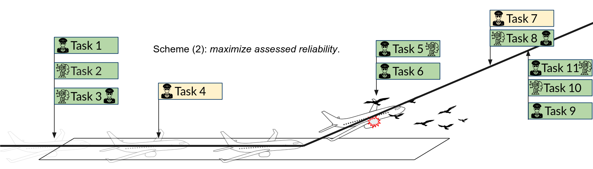
 </section>

---

<section class="slide--section">

<h1 class="r-fit-text">Scenario Demo</h1>

<em>I will act both as the PILOT and the FACILITATOR</em>

</section>

---

<section>
<h2>What to Watch</h2>

  

    <ul>
      <li>TARS alerts + recommendations</li>
      <li>Pilot actions with TARS in NORMAL and ABNORMAL situation</li>
      <li>Shared interface Aural/Visual cues</li>
      <li>Facilitator control platform (ingescape)</li>
    </ul>
  

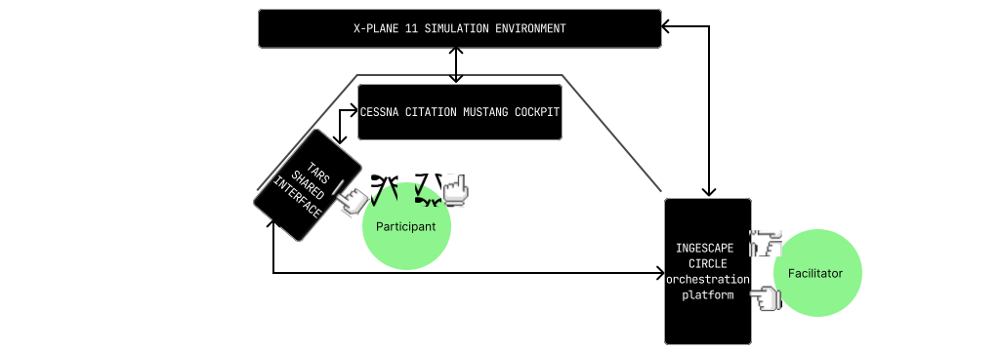
</section>

---

<section class="slide--section">
  

  <h1 class="r-fit-text">TARS Prototype</h1>
  
<em>How it relates to Interdependence Analysis ?</em>

</section>

---

<section>
<h2>TARS Functions</h2>

  

    <ul>
      <li>Propose procedure sequence as agreed in Briefing</li>
      <li>Display scenario progression at task and procedure level along with allocation</li>
      <li>Integrates an Electronic Checklist</li>
      <li>Perform and support as agreed in Briefing </li>
    </ul>
  

</section>

---

<section>
<h2>TARS Autonomy</h2>

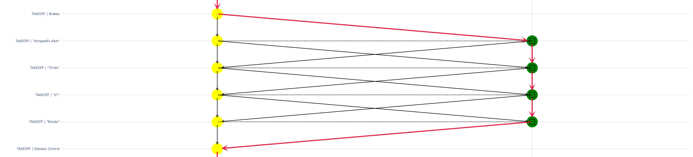

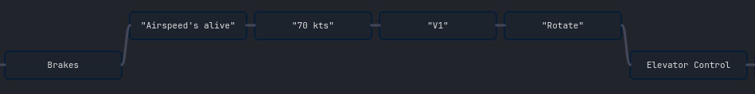

</section>
---

<section>
<h2>TARS Autonomy</h2>

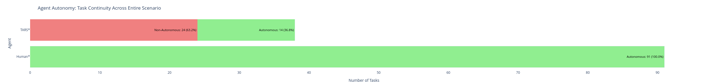

</section>

---

<section>
<h2>TARS Interdependence</h2>
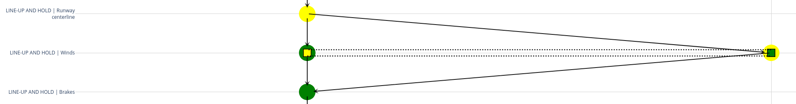
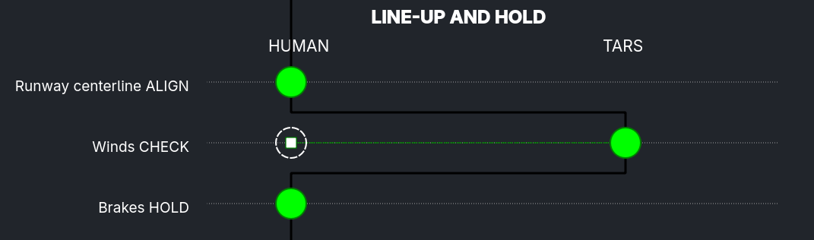
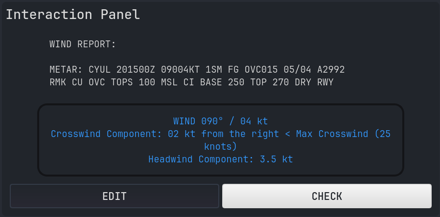
</section>

---

<section>
<h2>TARS Interdependence</h2>
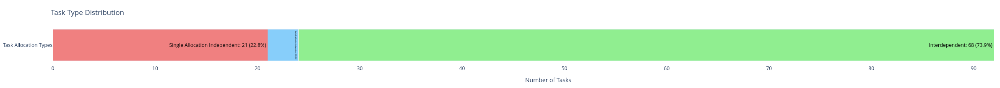
</section>

---

<section class="slide--section">
  

  <h1 class="r-fit-text">Shared Interface</h1>
  
<em>And how it relates to Interdependence Analysis</em>

</section>

---

<section>
  <h2>Interface anatomy</h2>
  

  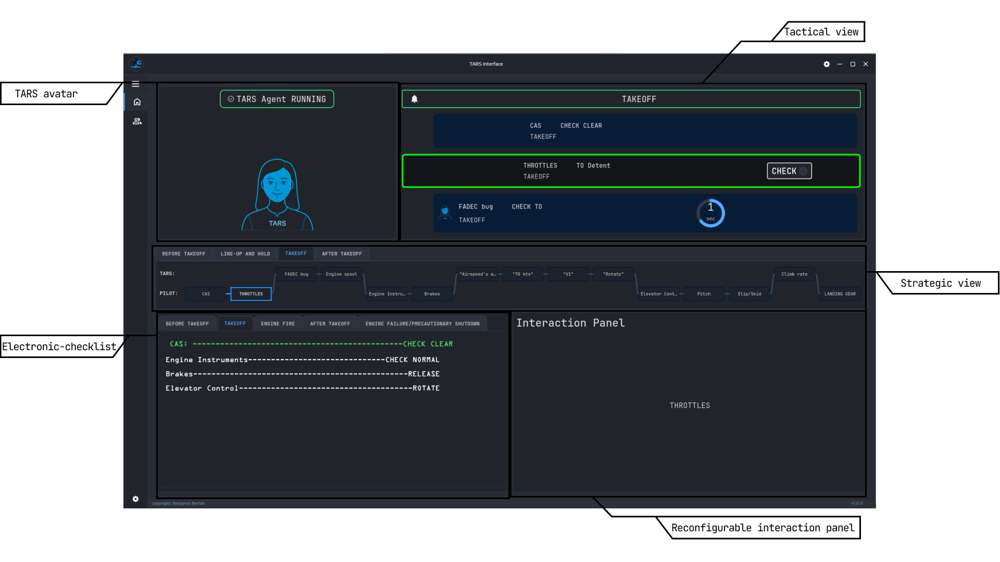
  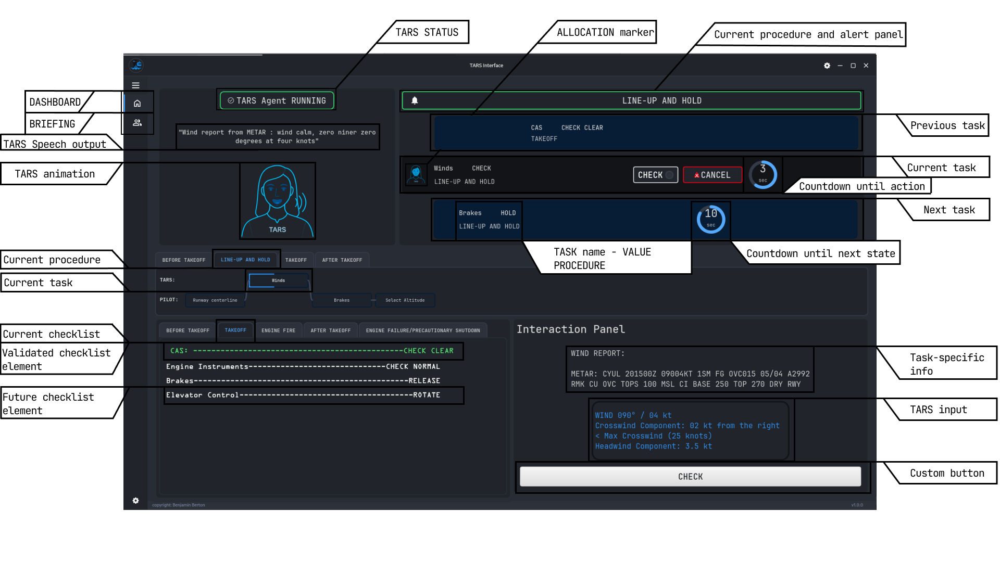
  

</section>

---

<section>
<h2>How does Obervability, Predictability and Directability requirements are generally embodied in the shared interface</h2>

  

    <ul>
      <li>Observability: Usually about externalizing current state and rationale for action/suggestions, and no modes approach</li>
      
      <li>Predictability: Algorithm consistency, visible timing for state switching, callouts (CRM), multiple projected views</li>
      
      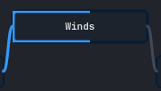
      <li>Directability: Mixed-initiative, never-mandatory always overridable safety-net approach, both vocally and touch input, ladder of abstraction</li>
      
      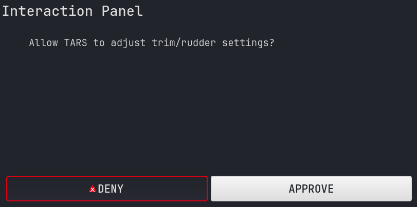
  

</section>

---

<section class="slide--section">
  

  <h1 class="r-fit-text">Winter Experiments</h1>
</section>

---

<section>
<h2>Study Design</h2>

  

    <ul>
      <li>4 Conditions: NO TARS; TARS full; TARS min; TARS custom</li>
      <li>Minimum 8 pilots for latin-square. CPL + IR (ME? MCC?)</li>
      <li>DV: </li>
      <li>Eye-tracking (AoI dwell times) + NASA-TLX + Behavior & performance, TARS customization </li>
    </ul>
  

  

    
  

</section>

---

<section>
<h2>Model Validation</h2>

  

    <ul>
      <li>Compare predicted vs empirical date using Root-Mean-Square Error, Mean Absolute Percentage Error, (I need to research more on Pearson correlation, Spearman's rho and Concordance Correlation Coefficient)</li>
      <li>Perform model tracing for custom</li>
    </ul>
  

</section>