# Presentation
Brickify: Enabling Expressive Design Intent Specification through Direct Manipulation on Design Tokens.    
In Proceedings of the 2025 CHI Conference on Human Factors in Computing Systems  
Xinyu Shi, Yinghou Wang, Ryan Rossi, and Jian Zhao

Notes:
- My First Notes
- My Second Notes

---

<section class="slide--section">
  

  <h1>First title</h1>
</section>

---
Introduce Brickify, a tool that extracts visual elements from reference images and converts them into interactive, reusable design tokens, that can be directly manipulated.
---
The design problem : 
Design as supposed: designer branch_decisions_1--> design
Design as proposed by TTI gen-AI: designer --> crappy intent --> model branch_decision_1 --> design
---
Proving the difficulty of using natural language for visual description:
-maybe do a quick little game where student are asked to provide a description to a tricky fuzzy image. Proof that natural language is a poor channel for visual description.
first example can be serious, as simple as name the colo, as simple as name the color.and the second can be the gold/blue robe to express that individual differences in perception is a first difficulty
---
User study : n=12 experienced designers.
1. Replication task, designers have a clear intent. We compare brickify with textual-centric prompting.
2. Open-ended task.
---
Mood board:
Brickify allows for sub-elements to be extracted from mood-board as design tokens.
---
Specifying intent Comparison with 
1. Modular prompting
2. Multimodal prompting
3. Prompting through direct manipulation
---
Translating intent comparison with
1. Subject-driven and style-specific personalized generation.
2. Spatial-aware controllable image generation and editing
---
User-centered Design methodology for Brickify.
S1. Problem understanding (method: semi-structured interview with six design experts)
  -Challenge 1: Failure to convery designer's attended elements to AI, active vision (e.g. selecting an image for a moodboard for a texture/detail)
  -Design goal 1: externalize designer's selective focus
  -Challenge 2: Difficulty in verbalizing element relationships, (it is not a textual task fundamentally, it is about spatial relationship between visual element)
  -Design goal 2: a flexible 2D workspace here designers can visually arrange and manipulate elements.
  -Challenge 3: Inefficiencies in iterative refinements (copy and paste previous prompt) 
  Design goal 3: Reuse individual elements to reduce repetitive manual work
S2. Early prototyping (method : co-design process with an expert designer)
  -weekly 30 minutes design meetings
  -low-fidelity mock-ups
  -non-functional prototype in Figma
  outcome: 1. reifying, 2. direct manipulation
S3. Prototype iteration (method: user study)
  -6 designers
  1. walkthrough the system
  2. exploratory use of the system with think-aloud verbalizations.
  feedback : strengthen the visual association between design tokens and original imagery to improvie clarity; introducing a cross-referencing feature to allow for more effective descriptions of relationships between subject tokens; added imaginatie token to the interaction vocabulary.
S4. System evaluation (Controlled user study)
  -12 participants
  -remote study 1 then 2
  -audio and video recorded
  -75-100 minutes
  -Creativity Support Index questionnaire after the two studies
  1. study 1: RQ: how does the visual-centric interaction paradigm of Brickify compare to the textual-centric paradigm in terms of clarity, mental effort and time investment for expressing design intent?
     1. 2x2 within-subject design with two primary factors: TECHNIQUE (BRICKIFY or BASELINE) x DIFFICULTY (EASY or HARD). Baseline means text prompt in a google doc, easy was set by an expert designer with fewer elements and simpler composition. random assignment
     2. Measurements:
        1. human-evaluation approach, with three external raters. using 5 likert scales:
           1. element coverage
           2. size clarity
           3. position clarity
           4. style clarity
           5. color clarity
        2. Participants' responses to five question evaluating intent expression
        3. Task completion times
        4. Participants' preferences betwen the two techniques
        5. Self reported cognitive load during the tasks (7-point likert scale)
  2. Study 2: RQ: How does BRICKIFY influence users' creative exploration when they start without a clear intent?
     1. Create a graphic series for a children's storybook about the adventures of an owl. the user needs to maintain visual consistency across all images. no time limit.
Show the HCD diagram to compare
---
Brickify: the system
Token types:
  -Visual token
  -Textual token
  -Imaginative token
  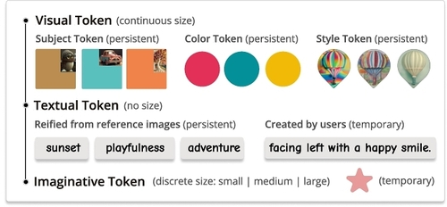
  can be persistent or temporary for reuse without overwhelming
  content-related tokens are persistent, context-related tokens are temporary
---
Brickify: the system
Direct manipulation:
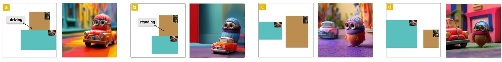
intuitive actions : 
- Drag-and-drop
- Move 
- Resize
- Group
- Link
- Cross-reference
---
Brickify interface
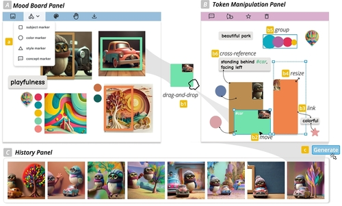
---
Brickify technical details:
I am not going to cover these
---
User study results
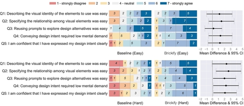
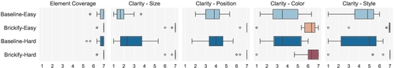
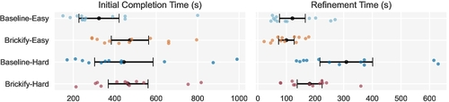
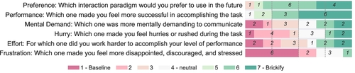
---
statistical analysis
non-parametric Aligned Rank Transform ANOVA to understand influence of TECHNIQUE and DIFFICULTY on user's self reported design intent expression experience
two-way random Intraclass Correlation Coefficient to measure the reliability of the ratings
---
User behavior
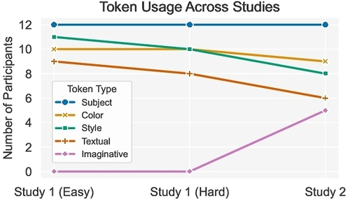
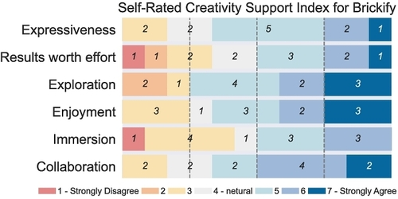
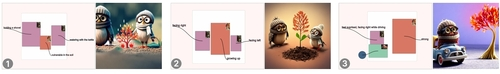
---
Observation and feedback
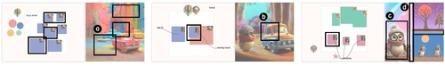

## Axiom
Tools should **amplify thought**, not merely **automate tasks**.

- Media shape ideas we are able to express.
- When the medium is *wrong*, progress stalls.

Notes:
- Name-check Engelbart / PARC lineage.
- Tie to audience’s domain in one sentence.

---

## Constraint → Consequence
- If our medium is **static documents**, we get **passive thinking**.  
- With **live, malleable representations**, we get **interactive reasoning**.

Example: spreadsheets vs. narrative memos; live models vs. slide bullets.

Notes:
- Keep tempo brisk; 20–30s per bullet.
- Gesture the contrast (static vs. live) with a quick demo if possible.

---

<section class="slide--section">
  

  <h1>Three Shifts</h1>
</section>

---

## 1) From Describing → to Manipulating
- Not *about* the system — **touch the system**.  
- Visibility → Directability → Predictability.

Notes:
- Briefly define O/D/P if relevant (HAT tie-in).

---

## 2) From Artifacts → to Media
- Programs as **materials** we shape.  
- Code as **communication** with ourselves.

---

## 3) From Solo → to Situated
- Tools are **social** and **spatial**.  
- Interfaces should model **teams**, not users.

---

<section class="slide--section">
  

  <h1>Implication</h1>
</section>

---

## Design Principle
**One idea per slide.**  
Prefer **clear sentences** over decorative graphics.

“Show me a medium and I will show you the kinds of thoughts it makes possible.”

Notes:
- Keep this slide up while you speak ~45s.

---

## What To Do Monday
- Replace bullet decks with **live documents**.  
- Make the **model visible**.  
- Bias for **manipulability** over reporting.

Notes:
- End with a concrete invitation.

---