<h1 class = "r-fit-text">Brickify</h1>  

**Enabling Expressive Design Intent Specification through Direct Manipulation on Design Tokens**  
*CHI 2025 — Xinyu Shi, Yinghou Wang, Ryan Rossi, Jian Zhao*

Notes:

---

<section class="slide--section">
  

  <h1 class = "r-fit-text">1. Introduction</h1>
</section>

---

## Visual abstract

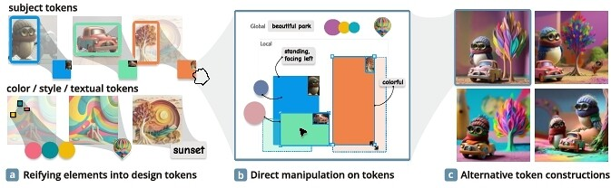

Notes:
I won't talk about the technical implementations of Brickify since it is outside the scope of the course
---

<h2  class="r-fit-text"> The Design Problem: </h2>

---
The TTI problem: Is Natural language good at describing visuals?

<ul>
<li class="fragment">Can you name those colors ?</li>

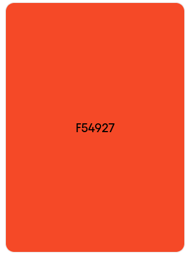
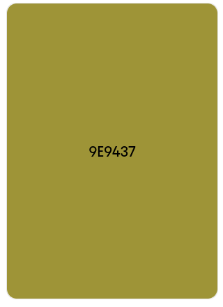
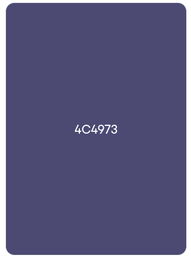

</ul>

---

The TTI problem: Is Natural language good at describing visuals?

What is the color of the dress?

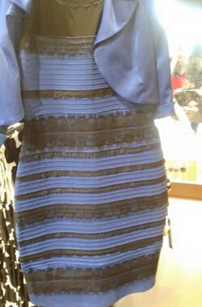

---
The TTI problem: Is Natural language good at describing visuals?
<ul>
<li class="fragment">Imprecise spatial relations</li>

</ul>
---

<section class="slide--section">
  

  <h1 class = "r-fit-text">2. Brickify Concept</h1>
</section>

---

## **Brickify** introduces a visual-centric paradigm:  

---

## From Text to Tokens

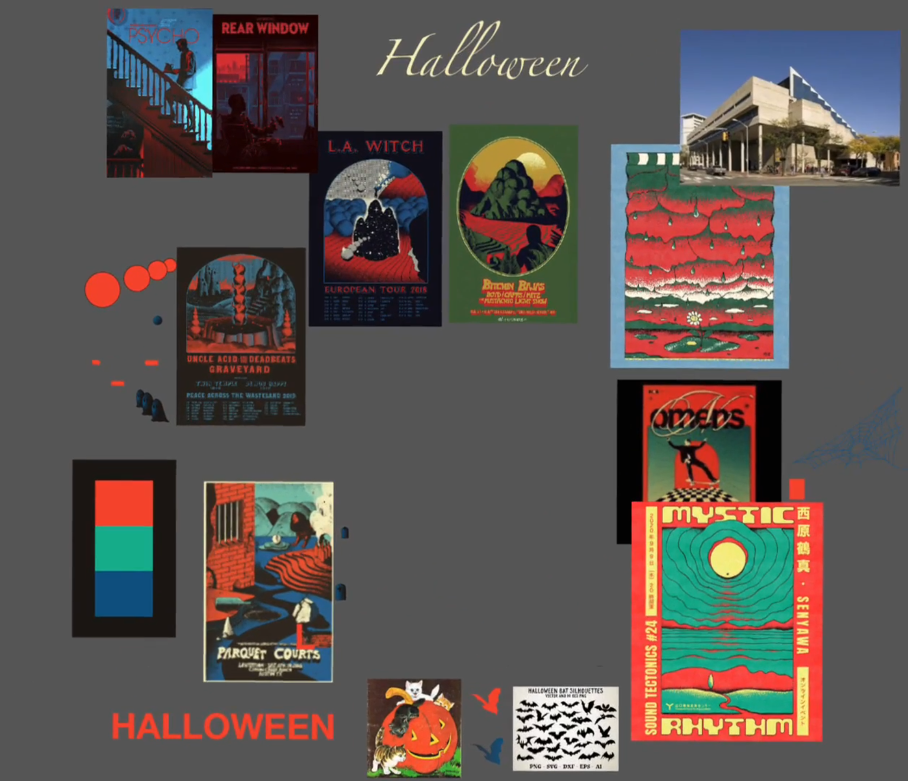
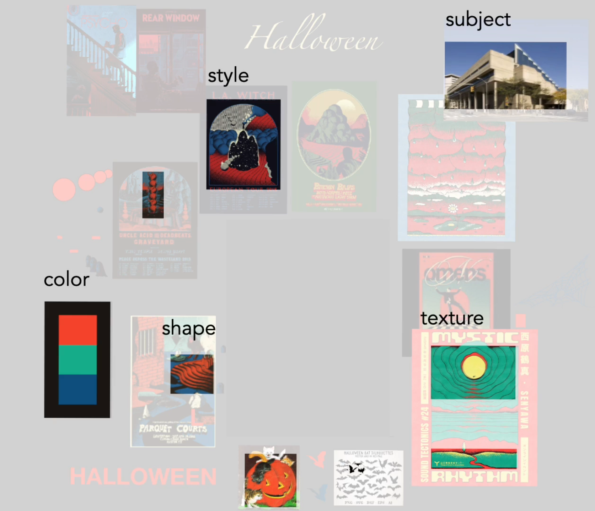

---

## From Tokens to Image

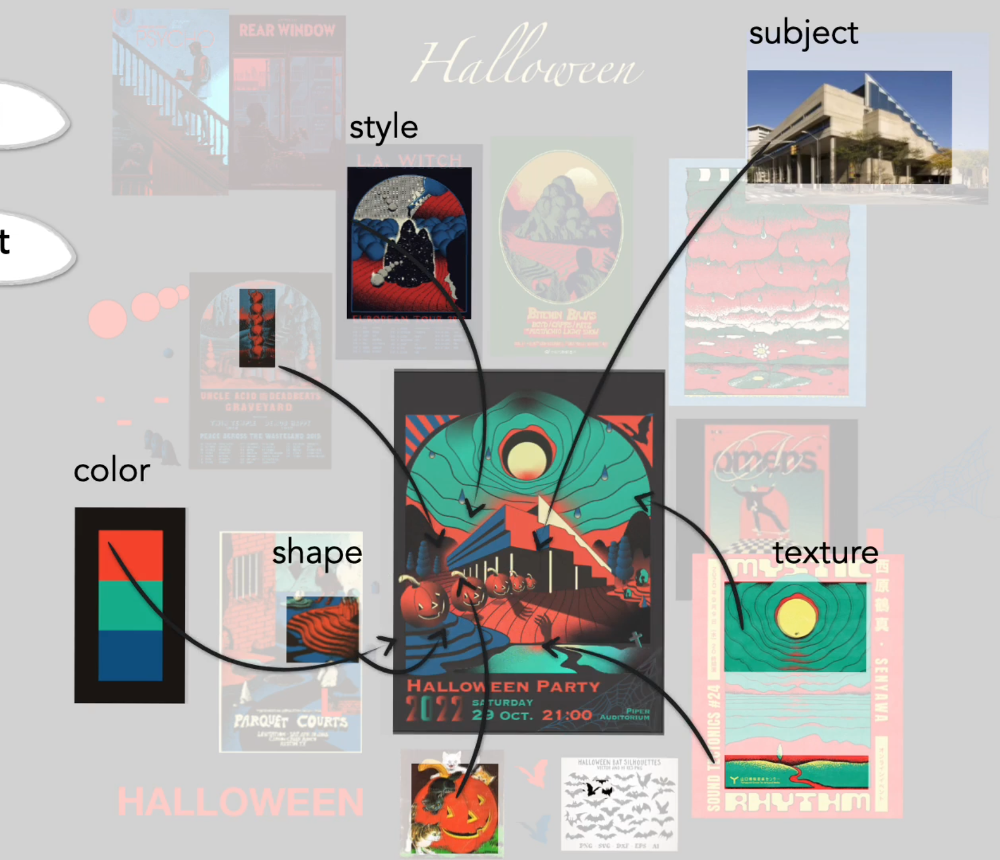

---

Each visual element becomes a **design token**.  

<li>Extract tokens from reference images</li> 

<li>Manipulate tokens (move, resize, link, group)</li> 
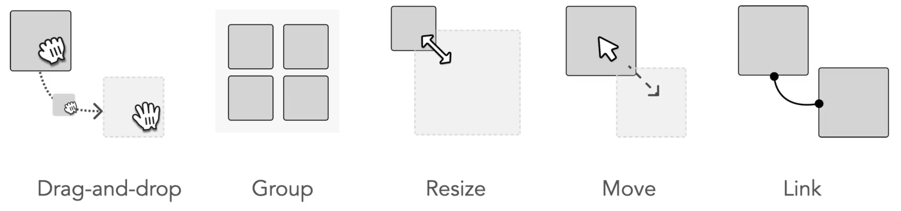
<li>Build a visual lexicon representing intent</li> 
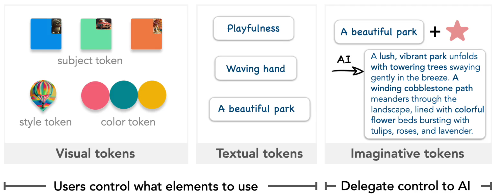

---

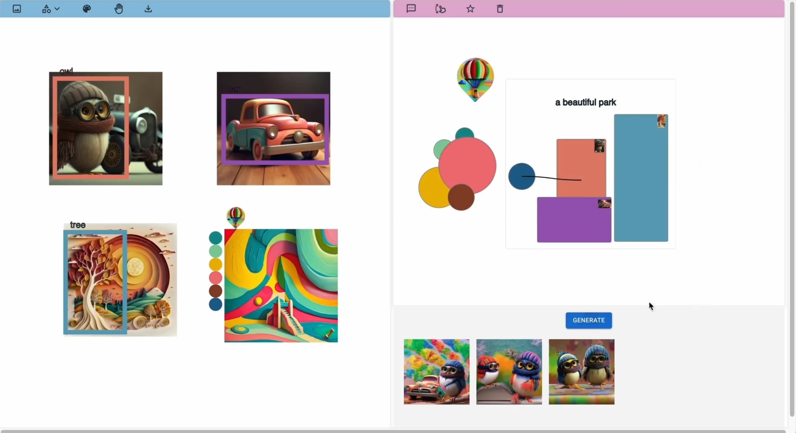

---

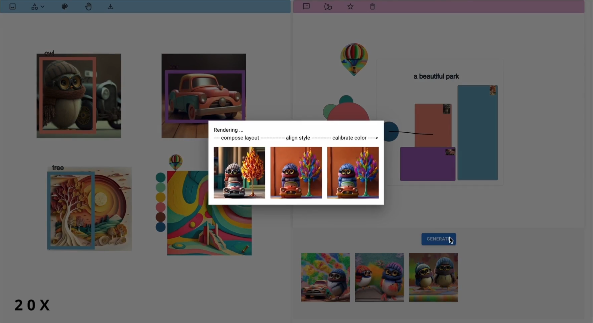

---

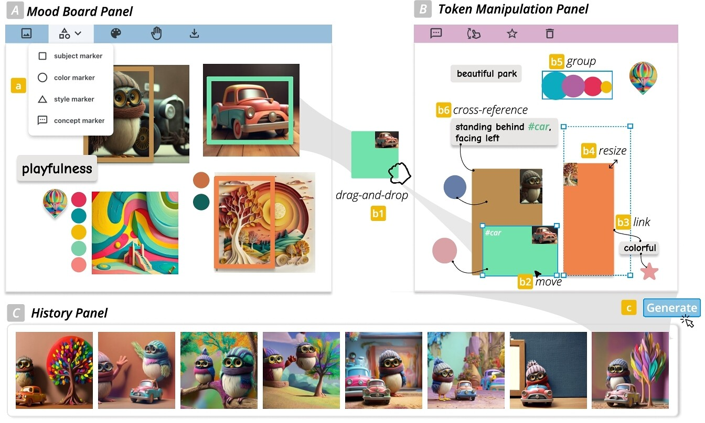

---

<section class="slide--section">
  

  <h1 class = "r-fit-text">3. Design Process</h1>
</section>

---

## Four Stages

**S1 – Problem Understanding:** 6 semi-structured interviews with SME 

**S2 – Early Prototyping:** co-design with 1 expert designer  

**S3 – Iteration:** feedback from 6 designers following a user test 

**S4 – Evaluation:** controlled user study (N = 12)
Notes: What is this design process ?
---

## Four Stages of HCD for comparison (ISO9241-210)

  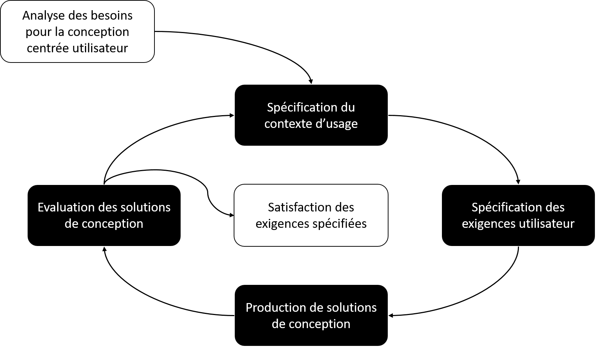

---

## S1 - Problem Understanding

Identified Challenges and associated Design Goals

<ul>
<li class="fragment">C1: Failing to convey attended elements to AI</li>
<ul><li class="fragment">DG1: Externalize selective focus</li></ul>
<li class="fragment">C2: Hard to verbalize relationships </li> 
<ul><li class="fragment">DG2: Enable spatial management & visual communication</li></ul>
<li class="fragment">C3: Inefficient iterative refinement</li>  
<ul><li class="fragment">DG3: Facilitate reuse & iteration</li></ul>
</ul>

---

## S2 - Early Prototyping:
- Weekly 30 minutes design meetings
- Low-fidelity mock-ups
- Non-functional prototype in Figma

---

## S3 - Prototype iteration
User study (n=6) designers
1. Walkthrough of the system
2. Exploratory use of the system with think-aloud verbalizations.

---

## S3 - Prototype iteration
Feedback
1. Strengthen the visual association between design tokens and original imagery to improve clarity
2. Introducing a cross-referencing feature to allow for more effective descriptions of relationships between subject tokens.
3. Added imaginative token to the interaction vocabulary

---

## S4: System evaluation
**Controlled user study** **Participants:** (n=12) experienced designers  

Two tasks:
1. **Task 1:** replication with a clear intent  
2. **Task 2:** open-ended exploration

---

## Task 1 — Comparison
RQ: how does the visual-centric interaction paradigm of Brickify compare to the textual-centric paradigm in terms of clarity, mental effort and time investment for expressing design intent?

2×2 within-subject design:  
**Technique** (Brickify vs Baseline) × **Difficulty** (Easy vs Hard)

  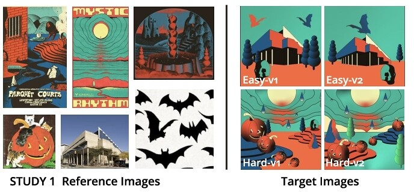

---

## Task 1 — Comparison

Metrics:

- human-evaluation (3 external raters using 5 likert scales)
   Element coverage, Size clarity, Position clarity, Style clarity, Color clarity
- Self evaluation of intent expression (5 questions)  
- Task time (initial completion and refinement) 
- Preferences  
- Self reported cognitive load   

---

## Task 1 — Results
Participants showed a clear preference for Brickify

Brickify led to:
- ↑ Design intent expression experience
- ↓ Mental effort and frustration  
- ↑ Initial completion time
- ↓ Refinement time (in hard tasks)

Human raters confirmed **higher clarity in size, position, color, and style**.

---

## Task 2 — Exploration
RQ: How does BRICKIFY influence users' creative exploration when they start without a clear intent?

Task: create 3 storybook scenes about an owl’s adventures.  
Focus: creativity, consistency, and reuse of tokens.
Metrics:
- Creativity Support Index
- Token usage

  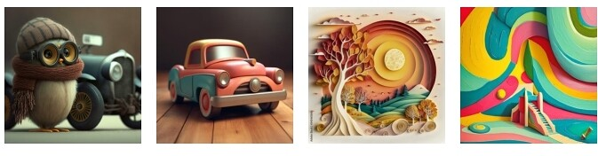

Notes: In this task, participants assumed the role of junior graphic designers tasked with creating a graphic series for a children’s storybook about the adventures of an owl. The senior designer provided four reference images (Figure 8) to define the visual characteristics. Participants were asked to create three images depicting scenes where the owl, with or without his friend and car, embarks on an adventure. The task required maintaining visual consistency across all images. There was no time limit, and participants worked until they felt their designs were complete.

---
<section class="image-slide">

## Task 2 - Results

Brickify shows strong support for creativity, effectively supports idea exploration, and is generally enjoyable to use.

</section>

---

<section class="slide--section">
  

  <h1>7. Discussion</h1t>
</section>

---

## Limitations
- Visual lexicon extraction could be improved
- Inference and computation costs could hinder user experience
- Brickify might fail in describing unseen visuals beyond recombination
- Study results might not be generalizable for design novices

---
## What about Multiple views and projection?

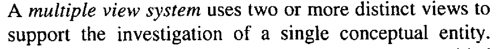

---

## Thank You
Questions?  
[https://doi.org/10.1145/3706598.3714087](https://doi.org/10.1145/3706598.3714087)

---