# 1

## Introduction
### Benjamin Berton

---

<!-- .slide: class="toc" -->
## Point sur le Lab
| | |
|---:|---|
| 01 | Présentations |
| 02 | Plan de cours |
| 03 | L’histoire du Web |
| 04 | Rappel de notion élémentaires de l’ergonomie |
| 05 | Utilisation au Québec et dans le monde |
| 06 |  |

---

## Présentations

---

## Qui suis-je ?

Formation et expérience professionnelle
Diplôme d’ingénieur spécialisé en Conception Numérique et Innovation – ESTIA, France
Maitrise en Ergonomie et ingénierie des facteurs humains – Université Paris Cité, France
1 an d’expérience en développement logiciel (Web, mobile, systèmes embarqués)
1 an d’expérience en tant qu’ergonome / investigateur UX sur un projet de simulateur pour les forces armées – MBDA, France
1 an d’expérience d’assistant de recherche Facteurs Humains sur les effets physiologiques et cognitifs de la Réalité Augmentée pour les pilotes d’aviation commercial – ESTIA/Airbus, France

---

## Qui suis-je ?

- Mes recherches et mon expérience d’enseignement
- Etudiant au doctorat en Facteurs Humains en aéronautique sous la direction du professeur Philippe Doyon-Poulin
- Je travaille sur la collaboration Humain – Intelligence Artificielle au sein d’un équipage d’avion
- J’ai enseigné le prototypage UX et la conduite d’entretien à des élèves en génie en France
- C’est la deuxième fois que j’enseigne ce cours, je suis jeune et débutant et compte sur vous pour me donner des retours constructifs afin que je m’améliore 

---

## Qui êtes-vous ?

- A quel programme êtes-vous inscrit?
- Quel est votre projet professionnel ?
- Pourquoi vous êtes-vous inscrit à ce cours ?
- Que connaissez vous de l’UX ?

---

<!-- .slide: class="toc" -->
## 13 cours, 4 TP 1 oral

---

<!-- .slide: class="toc" -->
## Plan de cours
| | |
|---:|---|
| Introduction et histoire du Web | Comprendre les notions |
| Conception centrée sur l’utilisateur | Choisir et utiliser les méthodologies |
| Les acteurs du processus | Développer des interfaces |
| Analyse des besoins et outils de recherche |  |
| Conception de site web |  |
| Architecture d’information |  |
| Théorie de la persuasion |  |
| Prototypage de sites Web |  |
| Design inclusif |  |
| Rédaction pour le web |  |

---

<!-- .slide: class="toc" -->
## Plan de cours
| TP | Titre | Type | Date de remise |
| --- | --- | --- | --- |
| TP1 10% | Comprendre et spécifier le contexte d’utilisation | Groupe projet | 30 janvier 2025 |
| TP2 20% | Évaluation heuristique | Individuel | 13 février 2025 |
| TP3 20% | Entretien utilisateur et tri de cartes | Groupe projet | 27 février 2025 |
| TP4 20% | Création de prototypes pour la refonte | Groupe projet | 13 mars 2025 |
| Oral 10% | Présentation orale du projet | Individuel | 17-28 mars |
| TP5 20% | Test d’usage et synthèse finale | Groupe projet | 3 avril 2025 |
- Comprendre les notions
- Choisir et utiliser les méthodologies
- Développer des interfaces

---

## Calendrier de cours
| Jan |  |  |  |  |  |  |
| --- | --- | --- | --- | --- | --- | --- |
| L | M | M | J | V | S | D |
|  |  | 1 | 2 | 3 | 4 | 5 |
| 6 | 7 | 8 | 9 | 10 | 11 | 12 |
| 13 | 14 | 15 | 16 | 17 | 18 | 19 |
| 20 | 21 | 22 | 23 | 24 | 25 | 26 |
| 27 | 28 | 29 | 30 | 31 |  |  |
| FEV |  |  |  |  |  |  |
| L | M | M | J | V | S | D |
|  |  |  |  |  | 1 | 2 |
| 3 | 4 | 5 | 6 | 7 | 8 | 9 |
| 10 | 11 | 12 | 13 | 14 | 15 | 16 |
| 17 | 18 | 19 | 20 | 21 | 22 | 23 |
| 24 | 25 | 26 | 27 | 28 |  |  |
| MAR |  |  |  |  |  |  |
| L | M | M | J | V | S | D |
|  |  |  |  |  | 1 | 2 |
| 3 | 4 | 5 | 6 | 7 | 8 | 9 |
| 10 | 11 | 12 | 13 | 14 | 15 | 16 |
| 17 | 18 | 19 | 20 | 21 | 22 | 23 |
| 24 | 25 | 26 | 27 | 28 | 29 | 30 |
| AVR |  |  |  |  |  |  |
| L | M | M | J | V | S | D |
| 31 | 1 | 2 | 3 | 4 | 5 | 6 |
| 7 | 8 | 9 | 10 | 11 | 12 | 13 |
| 14 | 15 | 16 | 17 | 18 | 19 | 20 |
| 21 | 22 | 23 | 24 | 25 | 26 | 27 |
| 28 | 29 | 30 |  |  |  |  |
| 1 | Pas de cours |
| --- | --- |
| 2 | Cours |
|  | Début/fin de session |
|  | Rendu TP |
|  | Période d’entretien individuel |
|  | Semaine de relâche |

---

## L’histoire du Web

Note:
Le Web est ainsi une des sphères d'Internet, Internet étant un réseau plus large regroupant différentes sphères (Web, courriel, FTP, etc.).

---

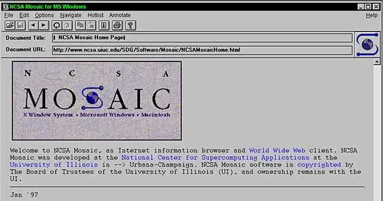
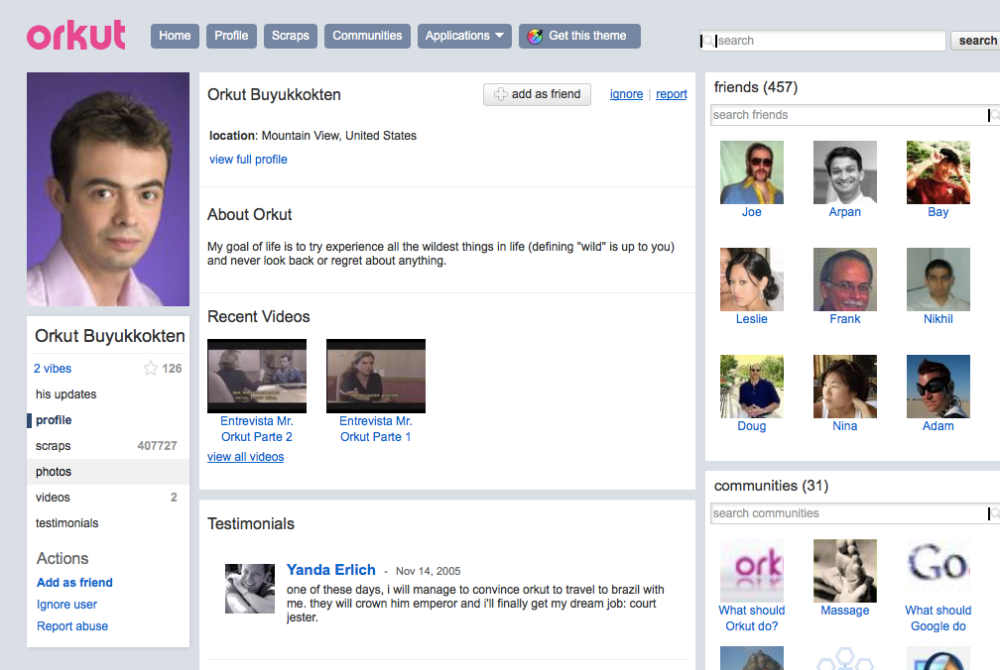

---

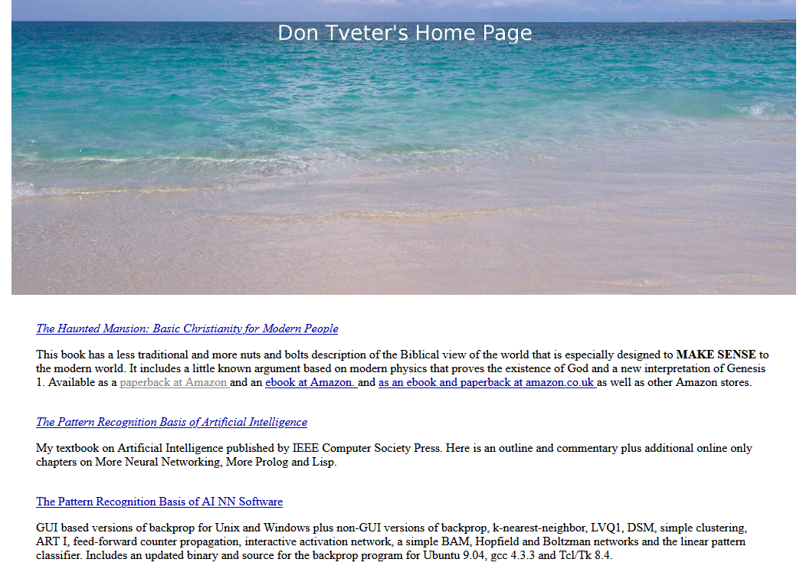

- [https://www.dontveter.com/index.html](https://www.dontveter.com/index.html)
| Version | Période | Caractéristique principals |
| --- | --- | --- |
| Web 1.0 | Année 1990-2000 | Statique, lecture seule, peu interactif (HTML, CSS) |
| Web 2.0 | Années 2000-2010 | Social, interactif, participatif, centralisé, monétisation des données (API, JS, SQL) |
| Web 3.0 | Années 2020 | Sémantique, décentralisé, centrée sur les données (RDF, OWL) |
| Web 4.0 | Futur proche | Intelligent, ubiquitaire, immersive (AR/VR, IoT, BCI) |

---

## Internet VS World Wide Web

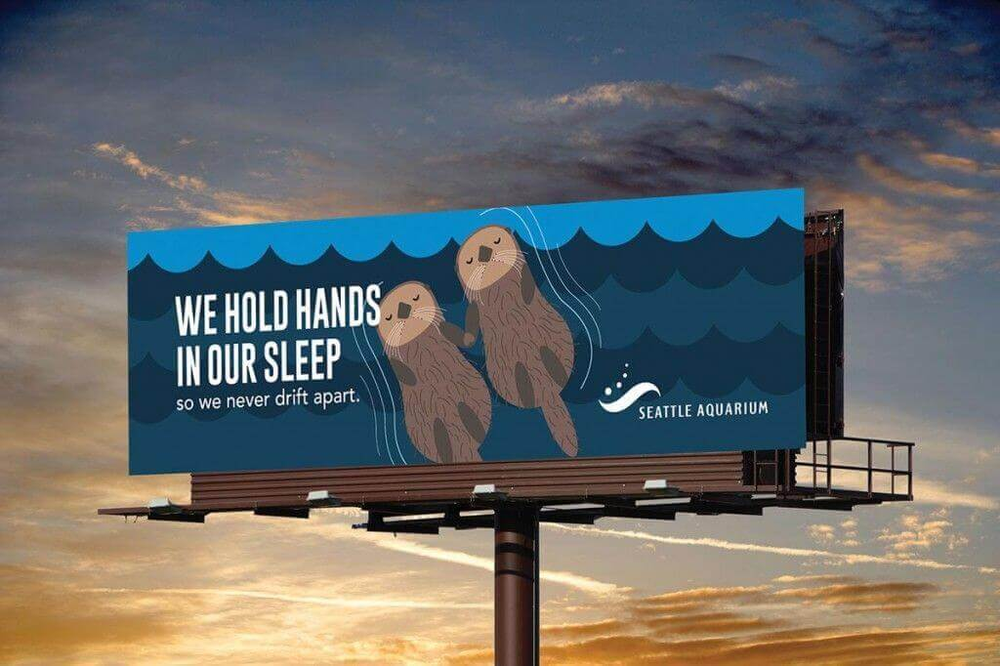

---

## Première page du World Wide Web
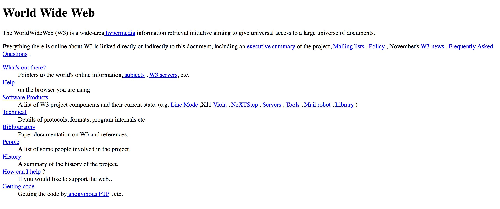
- [https://info.cern.ch/hypertext/WWW/TheProject.html](https://info.cern.ch/hypertext/WWW/TheProject.html)

Note:
On August 6, 1991, the first website was launched on the Internet, forever changing the way we browse. (And thankfully, web design has improved just a bit in the past two decades.) 
The first website was hosted on the web server info.cern.ch and was a simple text page containing exactly what the World Wide Web was for: a bunch of links. And of course, in the interest of paying it forward (and because the Web can’t work without other sites to link to), the first website included instructions for making your own website.
La "première version du Web", le Web 1.0 en quelque sorte que certains désignent comme un Web de documents, correspond à un Web où un petit nombre d'internautes étaient des créateurs de contenus, cette création demandant en effet des compétences informatiques plus avancées. La majorité des internautes était ainsi des observateurs pouvant chercher parmi les informations existantes et les consulter. Le modèle documentaire est alors clairement celui d'une bibliothèque distribuée, sans murs, mais où l'information n'est pas classée de façon hiérarchisée, dans un arbre, mais distribuée en graphe (il existe autant de relations non hiérarchisées que de liaisons possibles entre les documents ou des parties de ces documents).
Web2.0 ou « Web social » est doté d'outils et de contenus interactifs qui permettent aux internautes de participer à la création de contenus Web, de partager de l'information en ligne et de communiquer entre eux. Les mots-clés ici sont "participer", "création de contenus" et "partager". Certains services et certaines technologies phares sont associés au Web 2.0. Apparition des blogues, wikis, réseaux sociaux, youtube, flickr, flux RSS, 
Le Web3.0 : le Web sémantique L'idée centrale de ce qu'ils identifient comme un Web de données est celle d'un Web où les documents sont « enrichis » de manière à les rendre compréhensibles non seulement aux humains, mais aussi aux machines pour en faciliter la réutilisation. Cet enrichissement se fait à l'aide de métadonnées permettant de décrire différents aspects des documents (par exemple, l'auteur, la date de création). Encore une idée de Tim Berners Lee, application type « excel » dans le navigateur, SaaS Business Model. Open Source Software Platform. Distributed Database –or what called as “The World Wide Database”. Web Personalization. Resource Pooling, Intelligent Web.
Web 4.0 pour le futur, pas d’infos du W3C, basé sur la blockchain, brain computer interfaces, AI, Mixed reality, metaverse, cryptomonnaies, NFT, etc…

---

## D’un point de vue économique

- Il y a eu la période de prospérité économique du milieu des années 1990. Les investisseurs disposaient alors d’importants capitaux à investir
- De nombreuses entreprises ont été créées, donnant naissance à une multitude de services en ligne et, du
- même coup, à une prolifération des sites Web.
- C’est l’apparition de l’aire du dot.com

Note:
2014 La barre du milliard de sites web est franchie.
1995-2000 des sociétés pionnières comme Yahoo, Amazon, eBay, Netscape, Compuserve et AOL,
La bulle spéculative éclata le 10 mars 2000 quand l'indice NASDAQ commença à chuter

---

## Le GUI et le début de l’UX

- En novembre 1979 l’équipe d’Apple (S. Jobs) visite le PARC.
- Des trois techniques présentées (Ethernet, smalltalk et GUI), Jobs retient que l’interface graphique.
- Il vient de trouver la pièce manquante : l'OS doit être masqué pour l'utilisateur, via une interface graphique

Note:
"En novembre 1979, Steve Jobs et son équipe d'Apple visitent Xerox PARC. Parmi les innovations présentées – Ethernet, Smalltalk et l'Interface Graphique Utilisateur (GUI) – c'est la GUI qui retient l'attention de Jobs. Cette technologie va inspirer la future interface des produits Apple, en plaçant l'accent sur une expérience utilisateur simplifiée et intuitive. Jobs réalise que masquer la complexité du système d'exploitation derrière une interface graphique conviviale est la clé pour rendre les ordinateurs accessibles à tous. Cette visite marque un tournant décisif dans la conception informatique, mettant l'expérience utilisateur au cœur de la technologie."

---

## Utilisation du webAu québec et dans le monde

- [https://datareportal.com/reports/digital-2024-canada](https://datareportal.com/reports/digital-2024-canada)
- [https://datareportal.com/reports/digital-2024-global-overview-report](https://datareportal.com/reports/digital-2024-global-overview-report)

Note:
D’après le CEFRIO En 2018, la presque totalité des adultes québécois (95 %) détient au moins un des cinq appareils électroniques suivants : ordinateur (portable ou de table), téléphone intelligent, tablette électronique, bracelet d'exercice connecté et montre intelligente.
En 2018, 83 % des adultes québécois utilisaient au moins un réseau social dans le cadre de leur utilisation personnelle d'Internet, ce qui représente une hausse notable de 16 points de pourcentage par rapport à 2016.

---

## Utilisation du Web

- [https://websitesetup.org/news/how-many-websites-are-there/](https://websitesetup.org/news/how-many-websites-are-there/)
Utilisation du Web
- Nombre de sites web
- Part des usagers
- 24%
- 33%
- 37%
- 20%
- 59%
- 70%
- 17%
- [https://wearesocial.com/uk/blog/2010/01/social-technographics-ladder/](https://wearesocial.com/uk/blog/2010/01/social-technographics-ladder/)

---

## Il y a plus d’1.2 milliard de sites web…
- [https://www.worldwidewebsize.com/](https://www.worldwidewebsize.com/)
- 17% de ces sites sont actifs, 83% sont inactifs.
- 252,000 nouveaux sites web sont créés chaque jour
- 3 nouveaux sites web sont créés chaque seconde

---

## A quoi ressemblaient les sites ?
### Source : http://www.telegraph.co.uk/technology/6125914/How-20-popular-websites-looked-when-they-launched.html

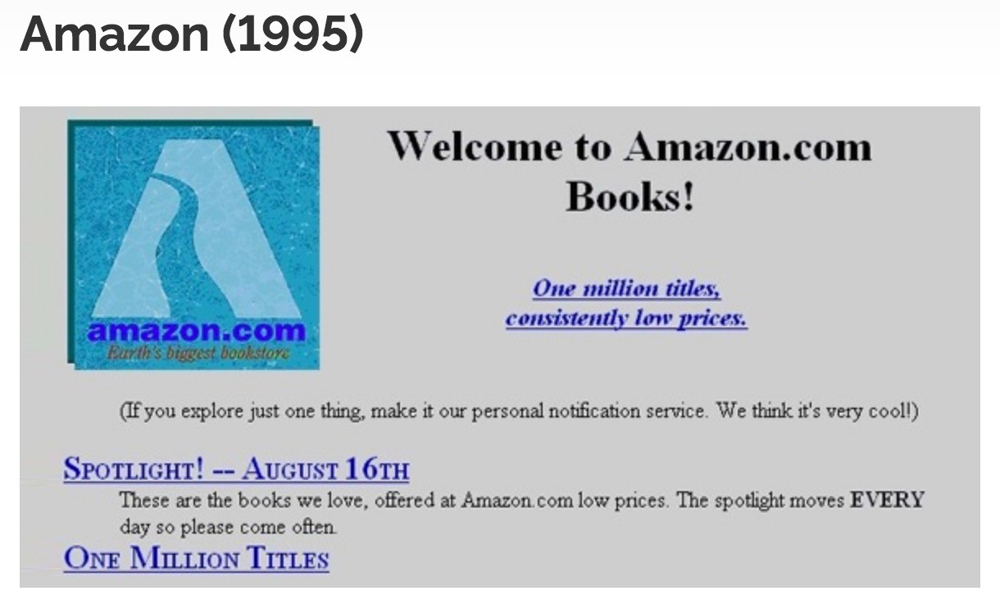

---

## A quoi ressemblaient les sites ?
### Source : http://www.telegraph.co.uk/technology/6125914/How-20-popular-websites-looked-when-they-launched.html

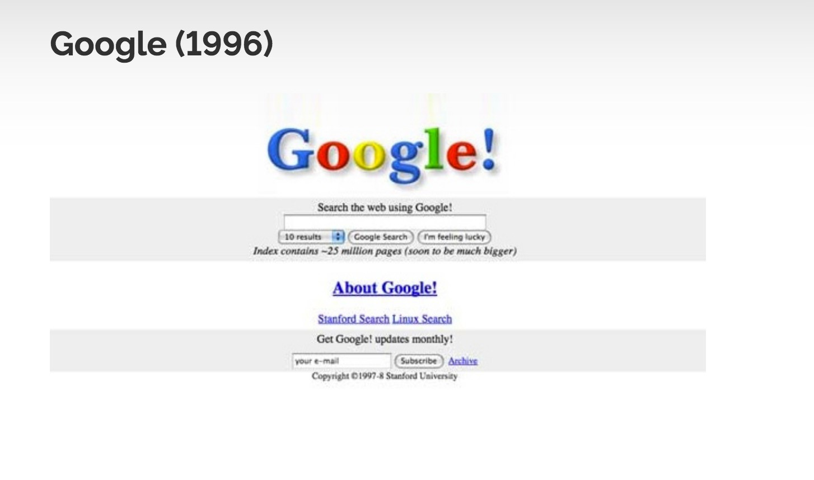
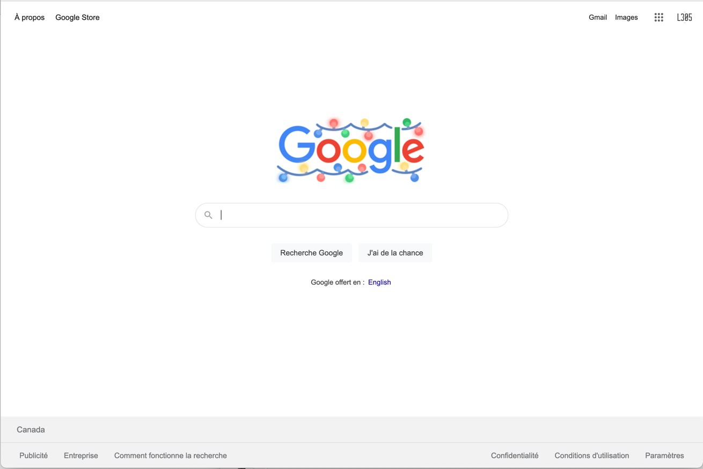

---

## A quoi ressemblaient les sites ?
### Source : http://www.telegraph.co.uk/technology/6125914/How-20-popular-websites-looked-when-they-launched.html

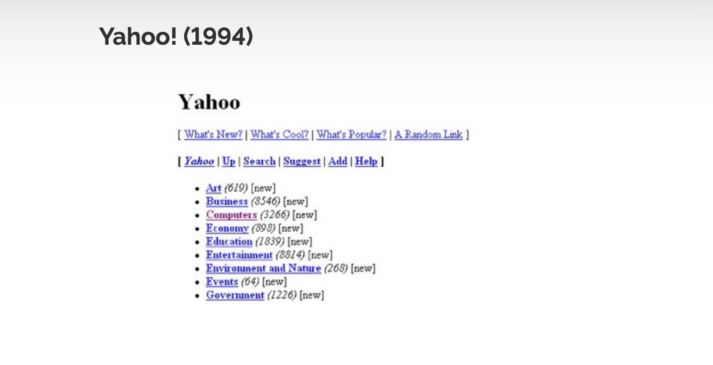

---

## A quoi ressemblaient les sites ?
### Source : http://www.telegraph.co.uk/technology/6125914/How-20-popular-websites-looked-when-they-launched.html

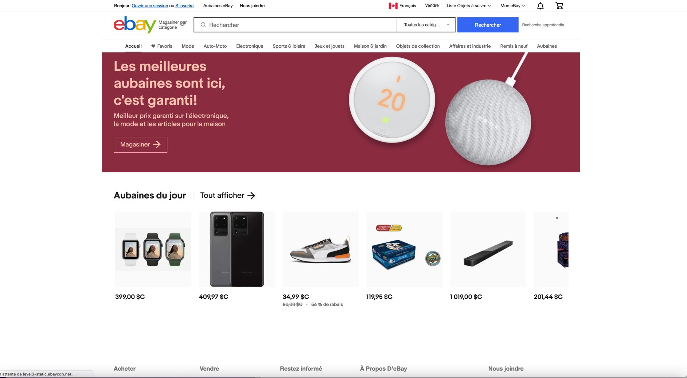
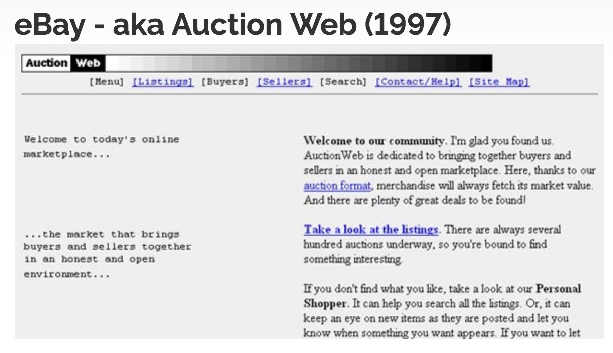

---

## A quoi ressemblaient les sites ?
### Source : http://www.telegraph.co.uk/technology/6125914/How-20-popular-websites-looked-when-they-launched.html
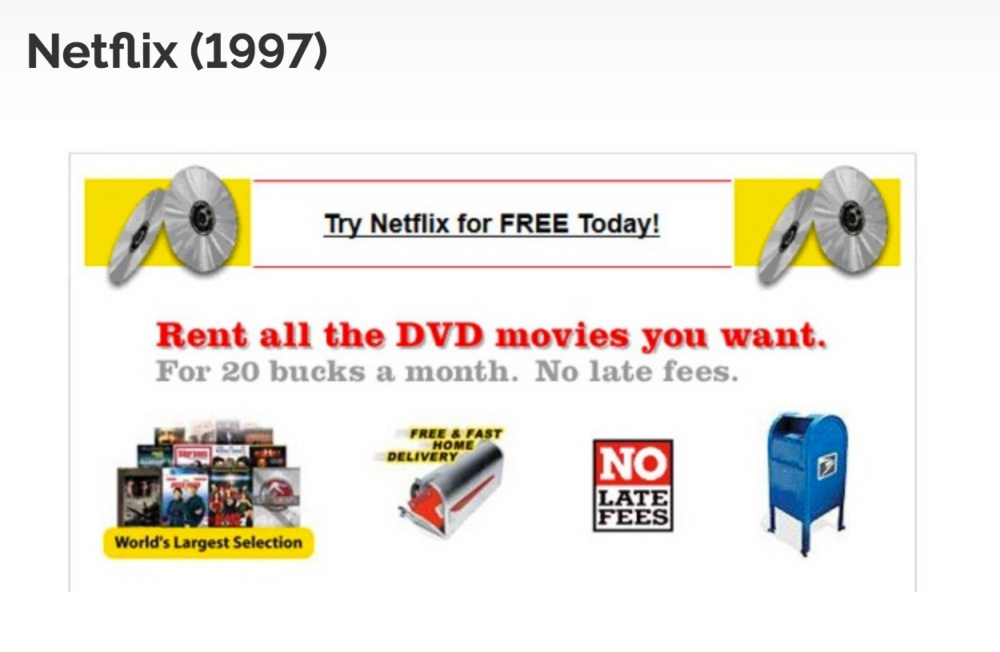

---

## A quoi ressemblaient les sites ?
### Source : http://www.telegraph.co.uk/technology/6125914/How-20-popular-websites-looked-when-they-launched.html

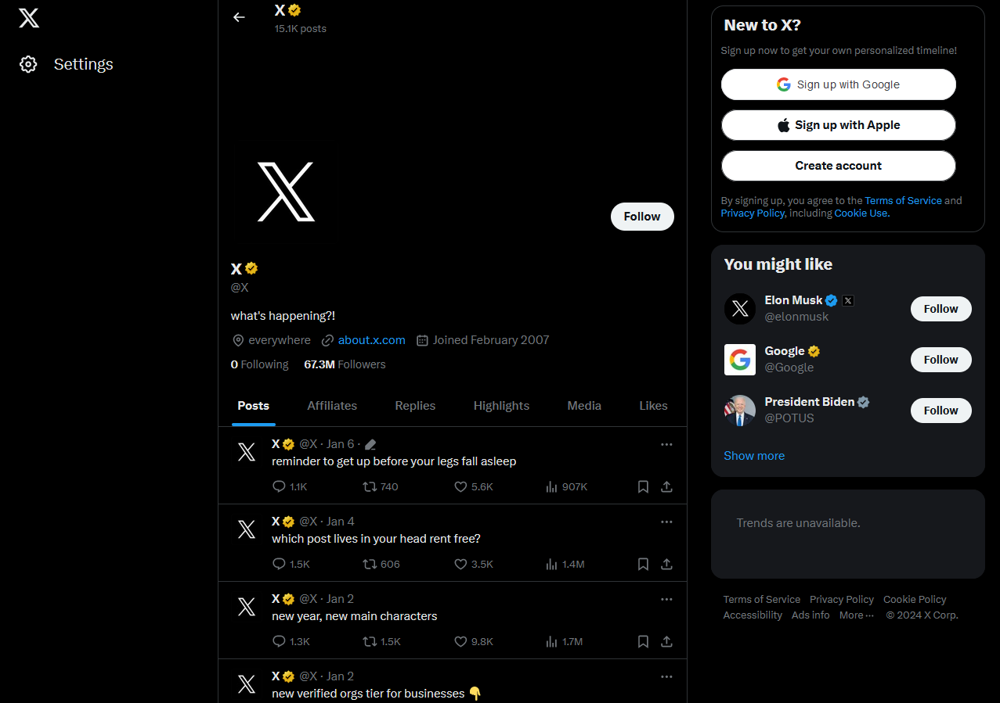

---

## Rappel de notions élémentaires de l’ergonomie

---

## La pire interface possible

- [https://userinyerface.com/](https://userinyerface.com/)

---

## Focus sur l’ergonomie cognitive

L'ergonomie cognitive s’intéresse aux processus mentaux, tels que la perception, la mémoire, le raisonnement et les réponses motrices.
Les grands thèmes de l’ergonomie cognitive sont: la charge mentale, la prise de décision, l’utilité, la performance, la vigilance, la conscience de la situation, les modèles mentaux, le stress, etc...

---

## Qu’est-ce que l’ergonomie cognitive
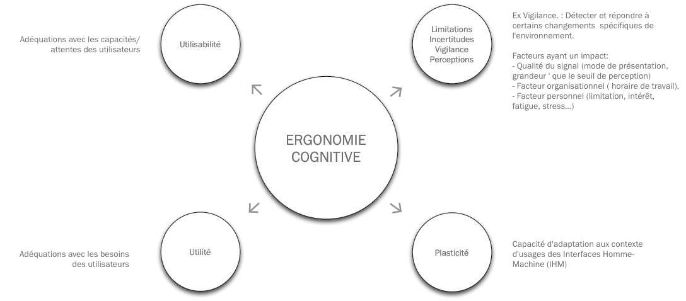

---

## Une notion centrale en UX

- Satisfaction
- C’est la mesure du degré de facilité avec laquelle un utilisateur accomplit une tâche donnée.
- Mais que veulent les utilisateurs ?
- La possibilité d’accomplir leurs objectifs (ce pour quoi ils étaient venus visiter le site) sans faire d’erreurs et dans un temps raisonnable.
- Efficacité
- Efficience

Note:
L’efficacité: le produit permet à ses utilisateurs d’atteindre le résultat prévu ;
L’efficience: atteint le résultat avec un effort moindre ou
requiert un temps minimal ;
La satisfaction: confort et évaluation subjective de
l’interaction pour l’utilisateur.

---

## Sensoriel (visuel et auditif)
### Couleur, contraste, grosseur du texte, sous-titrage…

Moteur (tremblement, arthrite,…)
Grosseur des cibles, type d’interactions
Cognitif (mémoire, traitement de l’information)
qualité informationnelle, complexité des textes, rétroaction, persuasion, intention, intérêt, attentes …

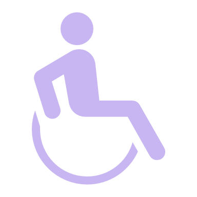
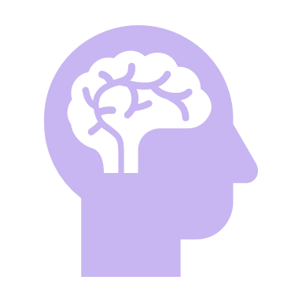

---

## Zoom sur la perception visuelle

- C'est par le sens de la vue que nous percevons:
- La lumière
- Les formes
- Les couleurs
- Et que nous distinguons :
- Les détails des objets,
- Leur distance
- Leur relief

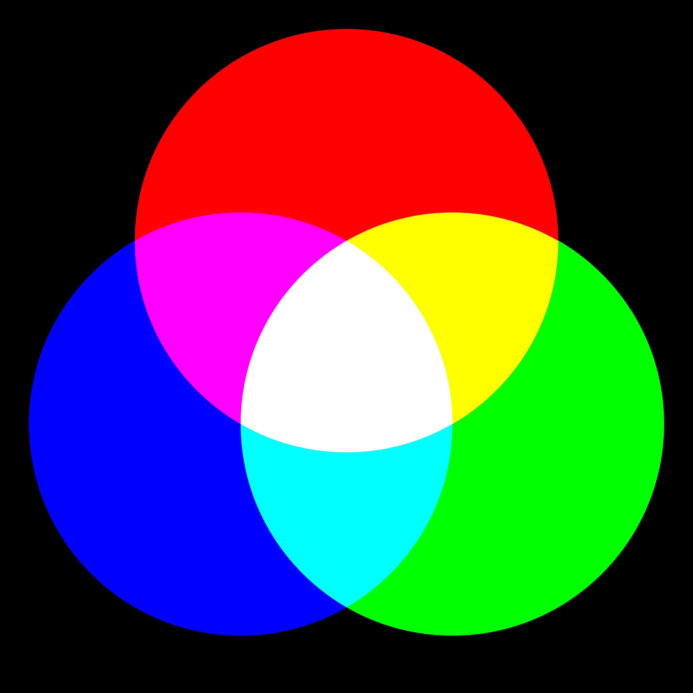

Note:
C'est par le sens de la vue que nous percevons la lumière, les formes et les couleurs, que nous distinguons les détails des objets, leur distance et leur relief.

Les cônes et les bâtonnets sont des neurones très courts qui se distinguent par leur forme et par la nature des pigments photosensibles qu'ils contiennent.
Les cônes ont une résolution spatiale très élevée et sont sensibles aux formes et aux couleurs des objets ; ce sont les cellules de la vision diurne. Il en existe près de 7 millions et sont particulièrement concentrés dans la partie centrale de la rétine, appelée fovéa ou macula.
Les bâtonnets, au nombre de 130 millions, sont quant à eux extrêmement sensibles à la lumière (100 fois plus sensibles que les cônes) mais aussi au mouvement ; ce sont les cellules de la vision nocturne.

---

## Perception visuelle et daltonisme

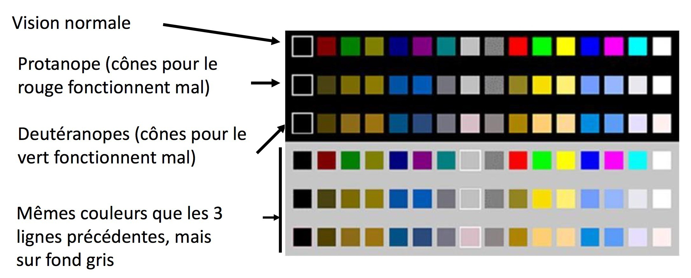

Note:
C'est par le sens de la vue que nous percevons la lumière, les formes et les couleurs, que nous distinguons les détails des objets, leur distance et leur relief.

Les cônes et les bâtonnets sont des neurones très courts qui se distinguent par leur forme et par la nature des pigments photosensibles qu'ils contiennent.
Les cônes ont une résolution spatiale très élevée et sont sensibles aux formes et aux couleurs des objets ; ce sont les cellules de la vision diurne. Il en existe près de 7 millions et sont particulièrement concentrés dans la partie centrale de la rétine, appelée fovéa ou macula.
Les bâtonnets, au nombre de 130 millions, sont quant à eux extrêmement sensibles à la lumière (100 fois plus sensibles que les cônes) mais aussi au mouvement ; ce sont les cellules de la vision nocturne.

---

## Perception visuelle et daltonisme : protanope

- [https://www.toptal.com/designers/colorfilter/](https://www.toptal.com/designers/colorfilter/)

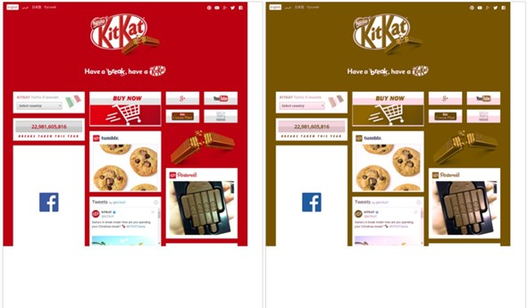

---

## Perception visuelle et daltonisme : Deutéranope

- [https://www.toptal.com/designers/colorfilter/](https://www.toptal.com/designers/colorfilter/)

---

## Perception visuelle et daltonisme : Achromatopsie

- [https://www.toptal.com/designers/colorfilter/](https://www.toptal.com/designers/colorfilter/)

---

## Perception visuelle et daltonisme : exemples
### Source: https://colour-blindness.org/guide

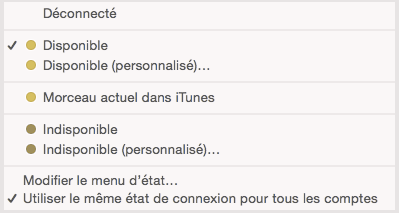
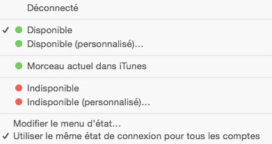

---

## Les lois de la gelstat

Le mot allemand Gestalt est traduit par « forme »
Ce sont des principes de la perception.
Devant la complexité de notre environnement, le cerveau va chercher à mettre en forme, à donner une structure signifiante à ce qu’il perçoit, afin de le simplifier et de l’organiser.

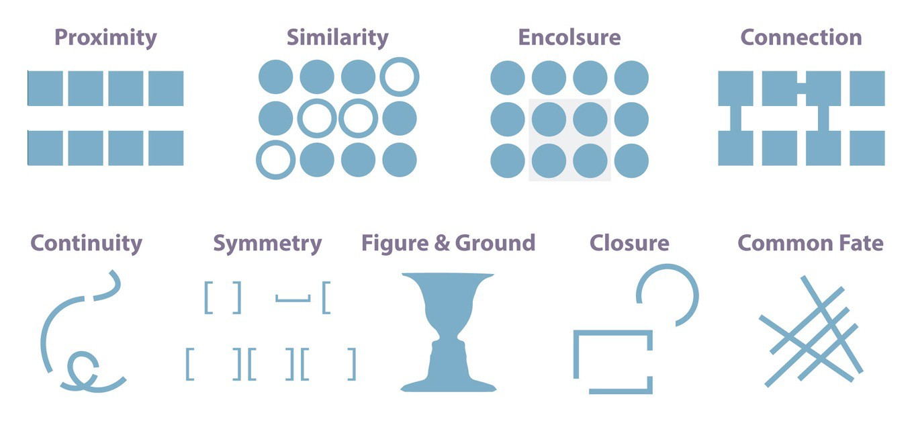

---

## Les lois de la gelstat
### Source: https://fr.slideshare.net/mccasal/lois-de-la-gestalt-et-webdesign

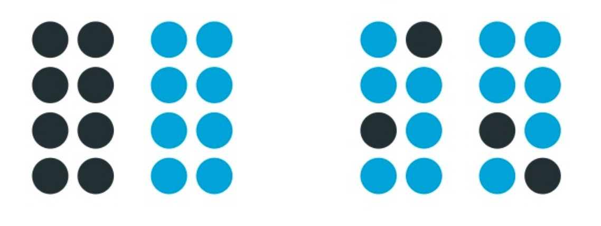

Note:
La loi de la proximité plus forte que la loi de la similitude

---

## Les lois de la gelstat
### Source: https://fr.slideshare.net/mccasal/lois-de-la-gestalt-et-webdesign

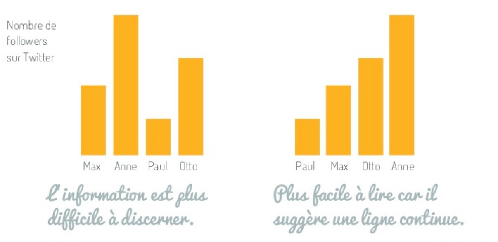

Note:
La loi de la proximité plus forte que la loi de la similitude

---

## Source: https://fr.slideshare.net/mccasal/lois-de-la-gestalt-et-webdesign
### Dans ce cas précis il s’agit d’une paréidolie visuelle, la reconnaissance d’une forme familière dans un paysage

Loi de Prägnanz (la bonne forme) : Il s’agit de la tendance à interpréter les images ambiguës comme si elles étaient simples et complètes. On parle également de « loi de bonne configuration », « loi de simplicité » ou « loi de précision ».
;-)

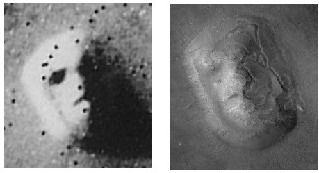

---

## L’effet Zeigarnik

Bluma Zeigarnik a mis en évidence, après une sortie au restaurant, que les serveurs ne semblaient pas se rappeler des détails des commandes qui étaient terminées, mais se rappelaient toutes celles en cours (ex. l’ordre).
Nos esprits oublient rapidement les tâches finies. Cependant, ils sont programmés pour nous rappeler incessamment celles que nous ne terminons pas.” – Dr. Bluma Zeigarnik.
Au cinéma : l’utilisation d’un cliffhanger (À SUIVRE/ c’est l’équivalent d’une pause)
Web: Amazon – Mettre de côté
Limite: il est nécessaire que votre objectif vous passionne un minimum, et que vous ayez vraiment envie de le voir accompli…

Note:
Psychologue russe.

---

## La loi de Hick
### Situation

- La loi de Hick prétend que plus l’on donne de choix à un utilisateur, plus la réponse de celui-ci sera longue et
- différée.
- La solution à cette problématique est donc de restreindre le nombre de choix et d’options au minimum acceptable.
- Attention donc aux menus, aux liens croisés, aux pages inutiles, aux boutons redondants et non pertinents.
Réaction

---

## La loi de Hick
### Loi de Hick, temps de réponse en fonction du nombre de choix

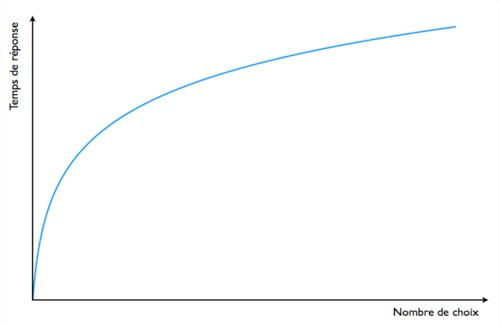
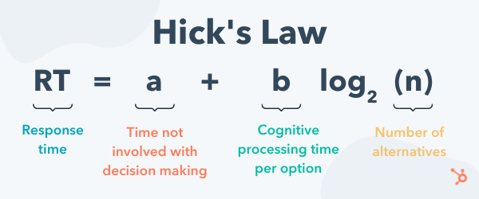

Note:
T : le temps de réponse.
a et b : une constante expérimentale en fonction de la situation.
n : le nombre de choix. Le +1 correspond à la décision de répondre ou non.

---

## La loi de Hick – Exemple
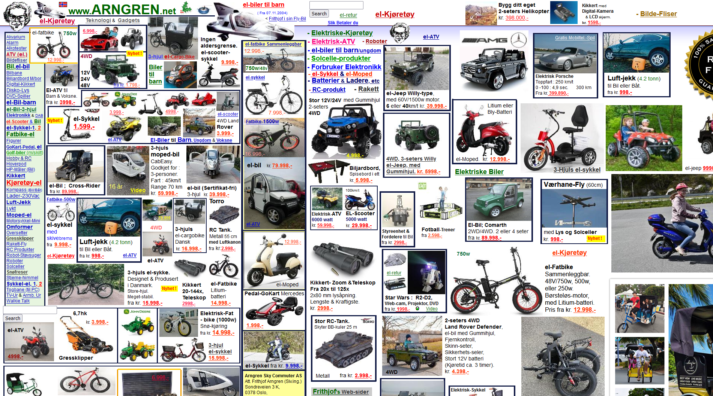
- [https://arngren.net/](https://arngren.net/)

---

## La loi de Fitts

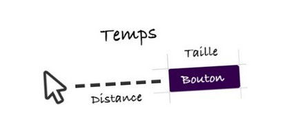

Note:
Cette loi mis en avant par le psychologue Paul Fitts en 1954 peut être exploité de bien des manières.
La loi de Fitts détermine le temps pour atteindre un objet et est définie par l’équation ci- dessous.
D représente la distance entre la position de la souris et le centre du bouton à cliquer.
S représente la hauteur du bouton calculée parallèlement à la droite reliant le centre du bouton et l’emplacement de la souris.

Source: Fitts, Paul M. (1954): The Information Capacity of the Human Motor System in Controlling the Amplitude of Movement. In Journal of Experimental Psychology, 47 pp. 381-391
La loi de Fitts veut que le temps de déplacement vers un élément soit fonction de la taille et de la distance de cet élément.

Exprimé différemment, plus votre élément est large et près, plus rapide sera la réaction de l’utilisateur.
Il est certain que les critères ont également un impact. tels que:
l’âge,
la perception visuelle

Rien n’oblige en effet à ce que la zone cliquable de votre bouton soit strictement limitée à la représentation graphique de ce dernier. Vous pouvez faire déborder la zone d’action du bouton afin de fluidifier son utilisation.

Le temps de pointage typique = 0,5 et 1 seconde.

---

## La loi de Fitts
### Source: http://particletree.com/features/visualizing-fittss-law/

---

## La loi de Fitts
### Adaptée aux écrans tactiles

Source: http://particletree.com/features/visualizing-fittss-law/

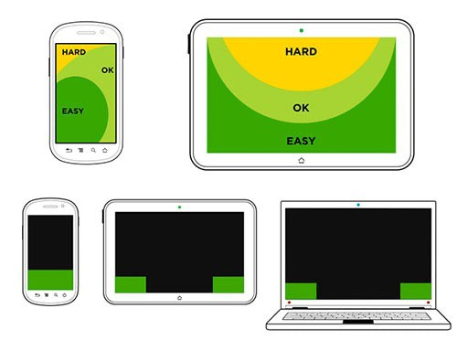

---

## Mobile :
### Source: http://particletree.com/features/visualizing-fittss-law/

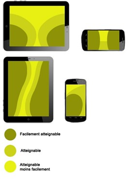

---

## Questions ?

- Semaine prochaine:
- Méthodologie de conception centrée sur l’utilisateur

---
