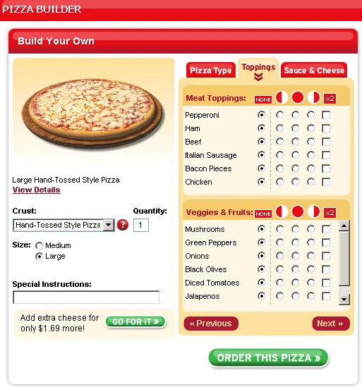
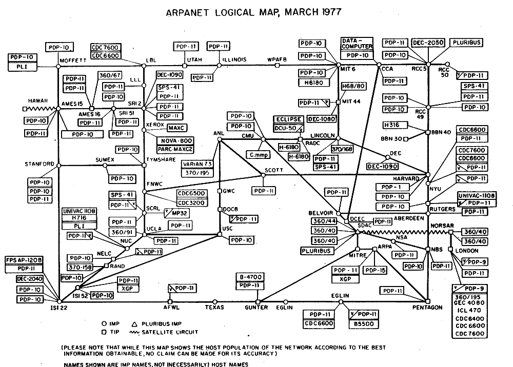
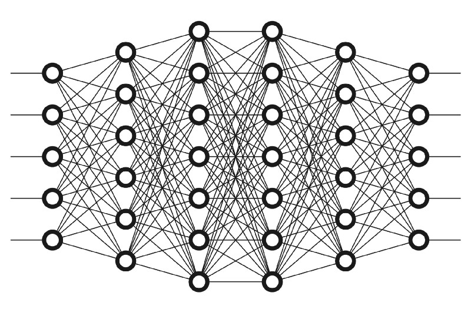

<section class="slide--section">

  

<h1 class="r-fit-text">Introduction</h1>

<em>IND8412A - Expérience utilisateur pour le Web</em>

</section>

---

<ol class="toc">
  <li>Présentation et logistique</li>
  <li>Histoire du Web</li>
  <li>éléments du cours</li>

---

<section>

<h2>Qui suis-je ?</h2>

  

    <ul>
      <li>Ingénieur</li>
      <li>Ergonome</li>
      <li>Doctorant en Facteurs Humains en aviation, ma spécialité est la modélisation cognitive</li>
    </ul>
  

</section>

---

<section>

<h2>Qui êtes-vous ?</h2>

  

    <ul>
      <li>A quel programme êtes-vous inscrit?</li>
      <li>Quel est votre projet professionnel ?</li>
      <li>Pourquoi vous êtes-vous inscrit à ce cours ?</li>
      <li>Que connaissez vous de l'UX ?</li>
    </ul>
  

</section>

---

<section class="slide--section">
  

  <h1>Plan de cours</h1>
  <h2 class="r-fit-text">Google doc disponible sur Moodle</h2>
</section>

---

<section>

<h2>Plan de cours</h2>

  

      <ol>
      <li>Introduction et histoire du Web</li>
      <li>Conception centrée sur l'utilisateur</li>
      <li>Les acteurs du processus</li>
      <li>Analyse des besoins et outils de recherche</li>
      <li>Conception de site web</li>
      <li>Architecture d'information</li>
      <li>Théorie de la persuasion</li>
      <li>Prototypage de sites Web</li>
      <li>Design inclusif</li>
      <li>Rédaction pour le web</li>
      </ol>
  

</section>

---

  <h1>Objectifs du cours</h1>

  

  <ul class="fragment">
  <li><h2>Comprendre les notions</h2></li>
  <li><h2>Choisir et utiliser les méthodologies</h2></li>
  <li><h2>Développer des interfaces</h2></li>
  </ul>
  

---

<section>

<h2>Plan de cours</h2>

  

    <table>
      <tr>
        <th>Travail</th>
        <th>Pondération</th>
        <th>Titre</th>
        <th>Type</th>
        <th>Date de remise</th>
      </tr>
      <tr>
        <td>Rapport 1</td>
        <td>10%</td>
        <td>Analyse du besoin</td>
        <td>Groupe projet</td>
        <td>5 février 2026</td>
      </tr>
      <tr>
        <td>Rapport 2</td>
        <td>25%</td>
        <td>Évaluation heuristique</td>
        <td>Individuel</td>
        <td>19 février 2026</td>
      </tr>
      <tr>
        <td>Rapport 3</td>
        <td>15%</td>
        <td>Définition des exigences</td>
        <td>Groupe projet</td>
        <td>12 mars 2026</td>
      </tr>
      <tr>
        <td>Rapport 4</td>
        <td>10%</td>
        <td>Maquettage et prototypage</td>
        <td>Groupe projet</td>
        <td>2 avril 2026</td>
      </tr>
      <tr>
        <td>Rapport 5</td>
        <td>15%</td>
        <td>Test d'usage et synthèse finale</td>
        <td>Groupe projet</td>
        <td>7 mai 2026</td>
      </tr>
      <tr>
        <td>Oral</td>
        <td>25%</td>
        <td>Présentation orale du projet</td>
        <td>Individuel</td>
        <td>Au choix</td>
      </tr>
    </table>
  

</section>

---

<section class="slide--section">
  

  <h1 class="r-fit-text">L'histoire du Web</h1>
  
<em>Des origines à nos jours</em>

  

  <aside class="notes">
  Le Web est ainsi une des sphères d'Internet, Internet étant un réseau plus large regroupant différentes sphères (Web, courriel, FTP, etc.).
  </aside>
</section>
---

<section data-auto-animate>

  
  
  
  
  
  

<aside class="notes">
Orkut a été lancé en 2004 avant Facebook par l'ingénieur turque Orkut Büyükkökten
1961 : Leonard Kleinrock, du MIT, publie le premier article sur la théorie de la commutation de paquets, posant les bases de l'Internet.
1967 : Lawrence Roberts, à la DARPA, présente les plans de l'ARPANET, le précurseur de l'Internet.
• 1969 : L'ARPANET connecte quatre nœuds (UCLA, Stanford, UCSB et Utah). Le premier message, "LOGIN", se termine par un crash après "LO". 
• 1972 : Ray Tomlinson crée le premier programme d'email et le format "nom@domaine“, le premier email envoyé est “QWERTYUP”
• 1976 : Robert Metcalfe développe l'Ethernet pour connecter des ordinateurs sur le réseau local. La reine Elizabeth envoie un email au ministre de la défence britannique, son nom d’utilisateur est HME2 (Her Majesty, Elizabeth II)
• 1989 : Tim Berners-Lee propose le World Wide Web au CERN.
• 1990 : Tim Berners-Lee crée le premier navigateur hypertexte,  ouvrant la voie au Web moderne. Le premier moteur de recherche, Archie est crée par Peter Deutsch à l’université McGill.
• 1991 : Les Etats-Unis approuvent l’utilisation d’internet par des compagnies privées, le premier achat est une pizza chez Pizza Hut en 94.
• 1993 : Lancement de Mosaic, le premier navigateur graphique, qui deviendra par la suite Netscape.
• 1995 : L'introduction en bourse de Netscape marque le début de la bulle Internet. Les enregistrements de domaines deviennent payants.
• 2005 : Lancement de YouTube, révolutionnant le partage de contenu video, les estoniens votent aux municipals par Internet.
• 2011 : Le nombre d'internautes atteint deux milliards.
• 2012 : Facebook dépasse les un milliard d’utilisateurs actifs. Amazon deviant le principal hébergeur d’internet. Gangnam style dépasse le milliard de vues sur Youtube
• 2013 : Twitter entre en bourse ; le trafic Internet est dominé par Netflix et YouTube (plus de 50% du traffic en bytes).
</aside>

</section>

<section data-auto-animate>
  
</section>

---

<section>

  

    <table>
      <tr>
        <th>Version</th>
        <th>Période</th>
        <th>Caractéristique principals</th>
      </tr>
      <tr>
        <td>Web 1.0</td>
        <td>Année 1990-2000</td>
        <td>Statique, lecture seule, peu interactif (HTML, CSS)</td>
      </tr>
      <tr>
        <td>Web 2.0</td>
        <td>Années 2000-2010</td>
        <td>Social, interactif, participatif, centralisé, monétisation des données (API, JS, SQL)</td>
      </tr>
      <tr>
        <td>Web 3.0</td>
        <td>Années 2020</td>
        <td>Sémantique, décentralisé, centrée sur les données (RDF, OWL)</td>
      </tr>
      <tr>
        <td>Web 4.0</td>
        <td>Futur proche</td>
        <td>Intelligent, ubiquitaire, immersif (AR/VR, IoT, BCI)</td>
      </tr>
    </table>
  

  

    
    
    
    
    
    

</section>

---

<section>

<h2>Internet VS World Wide Web</h2>

  

    
    
  

</section>

---

## Première page du World Wide Web

Note:
On August 6, 1991, the first website was launched on the Internet, forever changing the way we browse. (And thankfully, web design has improved just a bit in the past two decades.) 
The first website was hosted on the web server info.cern.ch and was a simple text page containing exactly what the World Wide Web was for: a bunch of links. And of course, in the interest of paying it forward (and because the Web can’t work without other sites to link to), the first website included instructions for making your own website.
La "première version du Web", le Web 1.0 en quelque sorte que certains désignent comme un Web de documents, correspond à un Web où un petit nombre d'internautes étaient des créateurs de contenus, cette création demandant en effet des compétences informatiques plus avancées. La majorité des internautes était ainsi des observateurs pouvant chercher parmi les informations existantes et les consulter. Le modèle documentaire est alors clairement celui d'une bibliothèque distribuée, sans murs, mais où l'information n'est pas classée de façon hiérarchisée, dans un arbre, mais distribuée en graphe (il existe autant de relations non hiérarchisées que de liaisons possibles entre les documents ou des parties de ces documents).
Web2.0 ou « Web social » est doté d'outils et de contenus interactifs qui permettent aux internautes de participer à la création de contenus Web, de partager de l'information en ligne et de communiquer entre eux. Les mots-clés ici sont "participer", "création de contenus" et "partager". Certains services et certaines technologies phares sont associés au Web 2.0. Apparition des blogues, wikis, réseaux sociaux, youtube, flickr, flux RSS, 
Le Web3.0 : le Web sémantique L'idée centrale de ce qu'ils identifient comme un Web de données est celle d'un Web où les documents sont « enrichis » de manière à les rendre compréhensibles non seulement aux humains, mais aussi aux machines pour en faciliter la réutilisation. Cet enrichissement se fait à l'aide de métadonnées permettant de décrire différents aspects des documents (par exemple, l'auteur, la date de création). Encore une idée de Tim Berners Lee, application type « excel » dans le navigateur, SaaS Business Model. Open Source Software Platform. Distributed Database –or what called as “The World Wide Database”. Web Personalization. Resource Pooling, Intelligent Web.
Web 4.0 pour le futur, pas d’infos du W3C, basé sur la blockchain, brain computer interfaces, AI, Mixed reality, metaverse, cryptomonnaies, NFT, etc…

---

<section>

<h2>D'un point de vue économique</h2>

  

    <ul>
      <li>Il y a eu la période de prospérité économique du milieu des années 1990. Les investisseurs disposaient alors d'importants capitaux à investir</li>
      <li>De nombreuses entreprises ont été créées, donnant naissance à une multitude de services en ligne et, du même coup, à une prolifération des sites Web</li>
      <li>C'est l'apparition de l'aire du dot.com</li>
    </ul>
  

    

</section>

---

<section class="slide--section">

  

<h1 class="r-fit-text">L'expérience utilisateur</h1>

<em>Sur les interfaces Web</em>

</section>

---

## Le GUI et le début de l’UX

  

- En novembre 1979 l’équipe d’Apple (S. Jobs) visite le XEROX PARC.

- Des trois techniques présentées (Ethernet, smalltalk et GUI), Jobs retient l’interface graphique.

- Il vient de trouver la pièce manquante : l'OS doit être masqué pour l'utilisateur, via une interface graphique

  

  

    

    
    <iframe width="600" height="400" src="https://www.youtube.com/embed/6o5I20WcNUM" title="Xerox Parc • Démonstration de l&#39;interface graphique (1982)" frameborder="0" allow="accelerometer; autoplay; clipboard-write; encrypted-media; gyroscope; picture-in-picture; web-share" referrerpolicy="strict-origin-when-cross-origin" allowfullscreen></iframe>
    

  

---

<section>

<h2>Utilisation du web au Québec et dans le monde</h2>

  

    
<strong>Ressources :</strong>

    <ul>
      <li><a href="https://datareportal.com/reports/digital-2026-canada">Data Report Canada 2026</a></li>
      <li><a href="https://datareportal.com/reports/digital-2026-global-overview-report">Data Report Global 2026</a></li>
      <li><a href="https://transformation-numerique.ulaval.ca/enquetes-et-mesures/netendances/portrait-numerique-des-regions-2024/">Portrait numérique des régions au Québec 2024</a></li>
    </ul>
  

</section>

---

<section>

<h2>Utilisation du Web</h2>

  

    
<strong>Part des usagers (2009 !!) :</strong>

    <ul>
      <li>Créateur : 24%</li>
      <li>Causeur : 33%</li>
      <li>Critique : 37%</li>
      <li>Collectionneur : 20%</li>
      <li>Social: 59%</li>
      <li>Spectateur : 70%</li>
      <li>Inactif : 17%</li>
    </ul>
  

  

    
    
<a href="https://wearesocial.com/uk/blog/2010/01/social-technographics-ladder/">Social Technographics Ladder</a>

  

Note: Inclus les usagers qui participent au moins une fois par mois aux activités indiqués.
</section>

---

<section>

<h2>Il y a plus d'1.2 milliard de sites web…</h2>

  

    
<strong>Source :</strong> <a href="https://www.worldwidewebsize.com/">worldwidewebsize.com</a>

    <ul>
      <li>17% de ces sites sont actifs, 83% sont inactifs</li>
      <li>252,000 nouveaux sites web sont créés chaque jour</li>
      <li>3 nouveaux sites web sont créés chaque seconde</li>
    </ul>
  

</section>

---

<section>

<h2>A quoi ressemblaient les sites ?</h2>

    
    

  

    
<strong>Source :</strong> <a href="http://www.telegraph.co.uk/technology/6125914/How-20-popular-websites-looked-when-they-launched.html">Telegraph - How 20 popular websites looked when they launched</a>

  

</section>

---

<section>

<h2>A quoi ressemblaient les sites ?</h2>

    
    

  

    
<strong>Source :</strong> <a href="http://www.telegraph.co.uk/technology/6125914/How-20-popular-websites-looked-when-they-launched.html">Telegraph - How 20 popular websites looked when they launched</a>

  

</section>

---

<section>

<h2>A quoi ressemblaient les sites ?</h2>

    
    

  

    
<strong>Source :</strong> <a href="http://www.telegraph.co.uk/technology/6125914/How-20-popular-websites-looked-when-they-launched.html">Telegraph - How 20 popular websites looked when they launched</a>

  

</section>

---

<section>

<h2>A quoi ressemblaient les sites ?</h2>

    
    

  

    
<strong>Source :</strong> <a href="http://www.telegraph.co.uk/technology/6125914/How-20-popular-websites-looked-when-they-launched.html">Telegraph - How 20 popular websites looked when they launched</a>

  

</section>

---

<section>

<h2>A quoi ressemblaient les sites ?</h2>

  

    
<strong>Source :</strong> <a href="http://www.telegraph.co.uk/technology/6125914/How-20-popular-websites-looked-when-they-launched.html">Telegraph - How 20 popular websites looked when they launched</a>

  

</section>

---

<section class="slide--section">
  

  <h1 class="r-fit-text">Introduction à l'ergonomie cognitive et son rapport à l'UX</h1>
</section>

---

<section>

<h2>Mais tout d'abord: est-ce vraiment utile de faire de l'UX/ergonomie ???</h2>

  

    
<strong>Exemple :</strong> <a href="https://userinyerface.com/">userinyerface.com</a>

  

</section>

---

<section>

 ## L'ergonomie cognitive s'intéresse aux processus mentaux

  

    
<strong>Les grands thèmes de l'ergonomie cognitive sont :</strong>

    <ul>
      <li>La perception</li>
      <li>La charge mentale</li>
      <li>La prise de décision</li>
      <li>La mémoire</li>
      <li>La performance</li>
      <li>La vigilance</li>
      <li>La conscience de la situation</li>
      <li>Les modèles mentaux</li>
      <li>Le stress</li>
    </ul>
  

</section>

---

<section>

<h2>L'utilisabilité : Une notion centrale en UX</h2>

  

    
C'est la mesure du degré de facilité avec laquelle un utilisateur accomplit une tâche donnée.

    
Souvent exprimé selon 3 grandes dimensions:

    <ul>
      <li><strong>Efficacité</strong>: le produit permet à ses utilisateurs d'atteindre le résultat prévu</li>
      <li><strong>Efficience</strong>: atteint le résultat avec un effort moindre ou requiert un temps minimal</li>
      <li><strong>Satisfaction</strong>: confort et évaluation subjective de l'interaction pour l'utilisateur</li>
    </ul>
  

</section>

---

<section>

<h2>Zoom sur la perception visuelle</h2>

  

    
C'est par le sens de la vue que nous percevons:

    <ul>
      <li>La lumière</li>
      <li>Les formes</li>
      <li>Les couleurs</li>
    </ul>
    
Et que nous distinguons :

    <ul>
      <li>Les détails des objets</li>
      <li>Leur distance</li>
      <li>Leur relief</li>
    </ul>
  

  

    
  

Notes: Les cônes ont une résolution spatiale très élevée et sont sensibles aux formes et aux couleurs des objets ; ce sont les cellules de la vision diurne. Il en existe près de 7 millions et sont particulièrement concentrés dans la partie centrale de la rétine, appelée fovéa ou macula.
Les bâtonnets, au nombre de 130 millions, sont quant à eux extrêmement sensibles à la lumière (100 fois plus sensibles que les cônes) mais aussi au mouvement ; ce sont les cellules de la vision nocturne.

</section>

---

<section>

<h2>Perception visuelle et daltonisme</h2>

  

    
  

</section>

---

<section>

<h2>Perception visuelle et daltonisme : protanope</h2>

  

    
<strong>Outil :</strong> <a href="https://www.toptal.com/designers/colorfilter/">Color Filter Tool</a>

  

  

    
  

</section>

---

<section>

<h2>Perception visuelle et daltonisme : Deutéranope</h2>

  

    
<strong>Outil :</strong> <a href="https://www.toptal.com/designers/colorfilter/">Color Filter Tool</a>

  

  

    
  

</section>

---

<section>

<h2>Perception visuelle et daltonisme : Achromatopsie</h2>

  

    
<strong>Outil :</strong> <a href="https://www.toptal.com/designers/colorfilter/">Color Filter Tool</a>

  

  

    
  

</section>

---

<section>

<h2>Perception visuelle et daltonisme : exemples</h2>

  

    
<strong>Source :</strong> <a href="https://colour-blindness.org/guide">colour-blindness.org/guide</a>

  

  

    
    
  

</section>

---

<section>

<h2>Les lois de la Gestalt</h2>

  

    
Le mot allemand Gestalt est traduit par « forme »

    
Ce sont des principes de la perception.

    
Devant la complexité de notre environnement, le cerveau va chercher à mettre en forme, à donner une structure signifiante à ce qu'il perçoit, afin de le simplifier et de l'organiser.

  

  

    
  

</section>

---

<section>

<h2>Les lois de la Gestalt</h2>

  

    
<strong>Source :</strong> <a href="https://fr.slideshare.net/mccasal/lois-de-la-gestalt-et-webdesign">Lois de la Gestalt et webdesign</a>

  

  

    Note.
    La loi de la proximité plus forte que la loi de la similitude
  

</section>

---

<section>

<h2>Les lois de la Gestalt</h2>

  

    
<strong>Source :</strong> <a href="https://fr.slideshare.net/mccasal/lois-de-la-gestalt-et-webdesign">Lois de la Gestalt et webdesign</a>

  

  

    Note.
    La loi de la proximité plus forte que la loi de la similitude
  

</section>

---

<section>

<h2>Loi de Prägnanz (la bonne forme)</h2>

  

    
<strong>Source :</strong> <a href="https://fr.slideshare.net/mccasal/lois-de-la-gestalt-et-webdesign">Lois de la Gestalt et webdesign</a>

    
Il s'agit de la tendance à interpréter les images ambiguës comme si elles étaient simples et complètes. On parle également de « loi de bonne configuration », « loi de simplicité » ou « loi de précision ».

    
Dans ce cas précis il s'agit d'une paréidolie visuelle, la reconnaissance d'une forme familière dans un paysage.

    
;-)

  

  

    
    
  

</section>

---

<section>

<h2>L'effet Zeigarnik</h2>

  

    
Bluma Zeigarnik a mis en évidence, après une sortie au restaurant, que les serveurs ne semblaient pas se rappeler des détails des commandes qui étaient terminées, mais se rappelaient toutes celles en cours (ex. l'ordre).

    
<em>« Nos esprits oublient rapidement les tâches finies. Cependant, ils sont programmés pour nous rappeler incessamment celles que nous ne terminons pas. »</em> – Dr. Bluma Zeigarnik

    
<strong>Applications :</strong>

    <ul>
      <li>Au cinéma : l'utilisation d'un cliffhanger (À SUIVRE/ c'est l'équivalent d'une pause)</li>
      <li>Web: Amazon – Mettre de côté</li>
      <li>Limite: il est nécessaire que votre objectif vous passionne un minimum, et que vous ayez vraiment envie de le voir accompli…</li>
    </ul>
  

  

    
  

  

    Note.
    Psychologue russe.
  

</section>

---

<section>

<h2>La loi de Hick</h2>
<h3>Situation</h3>

  

    <ul>
      <li>La loi de Hick prétend que plus l'on donne de choix à un utilisateur, plus la réponse de celui-ci sera longue et différée</li>
      <li>La solution à cette problématique est donc de restreindre le nombre de choix et d'options au minimum acceptable</li>
      <li>Attention donc aux menus, aux liens croisés, aux pages inutiles, aux boutons redondants et non pertinents</li>
    </ul>
    
<strong>Réaction</strong>

  

  

    
    
  

</section>

---

<section>

<h2>La loi de Hick</h2>
<h3>Loi de Hick, temps de réponse en fonction du nombre de choix</h3>

  

    
    
  

  

    Formule.
    T : le temps de réponse. a et b : une constante expérimentale en fonction de la situation. n : le nombre de choix. Le +1 correspond à la décision de répondre ou non.
  

</section>

---

<section>

<h2>La loi de Hick – Exemple</h2>

  

    
<a href="https://arngren.net/">https://arngren.net/</a>

  

</section>

---

## La loi de Fitts

Note:
Cette loi mis en avant par le psychologue Paul Fitts en 1954 peut être exploité de bien des manières.
La loi de Fitts détermine le temps pour atteindre un objet et est définie par l’équation ci- dessous.
D représente la distance entre la position de la souris et le centre du bouton à cliquer.
S représente la hauteur du bouton calculée parallèlement à la droite reliant le centre du bouton et l’emplacement de la souris.

Source: Fitts, Paul M. (1954): The Information Capacity of the Human Motor System in Controlling the Amplitude of Movement. In Journal of Experimental Psychology, 47 pp. 381-391
La loi de Fitts veut que le temps de déplacement vers un élément soit fonction de la taille et de la distance de cet élément.

Exprimé différemment, plus votre élément est large et près, plus rapide sera la réaction de l’utilisateur.
Il est certain que les critères ont également un impact. tels que:
l’âge,
la perception visuelle

Rien n’oblige en effet à ce que la zone cliquable de votre bouton soit strictement limitée à la représentation graphique de ce dernier. Vous pouvez faire déborder la zone d’action du bouton afin de fluidifier son utilisation.

Le temps de pointage typique = 0,5 et 1 seconde.
---

<section>

<h2>La loi de Fitts</h2>

  

    
<strong>Source :</strong> <a href="http://particletree.com/features/visualizing-fittss-law/">Visualizing Fitts's Law</a>

  

</section>

---

<section>

<h2>La loi de Fitts</h2>
<h3>Adaptée aux écrans tactiles</h3>

  

    
<strong>Source :</strong> <a href="http://particletree.com/features/visualizing-fittss-law/">Visualizing Fitts's Law</a>

  

</section>

---

<section>

<h2>Mobile :</h2>

  

    
<strong>Source :</strong> <a href="http://particletree.com/features/visualizing-fittss-law/">Visualizing Fitts's Law</a>

  

</section>

---

## Questions ?

- Semaine prochaine:
- Méthodologie de conception centrée sur l’utilisateur

---
