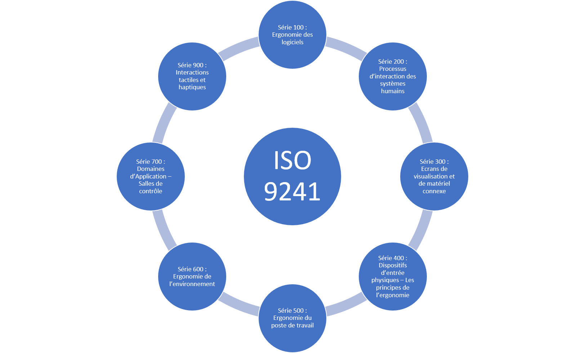
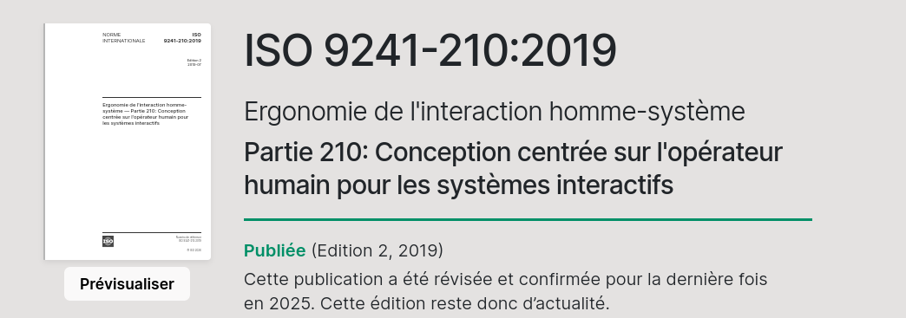
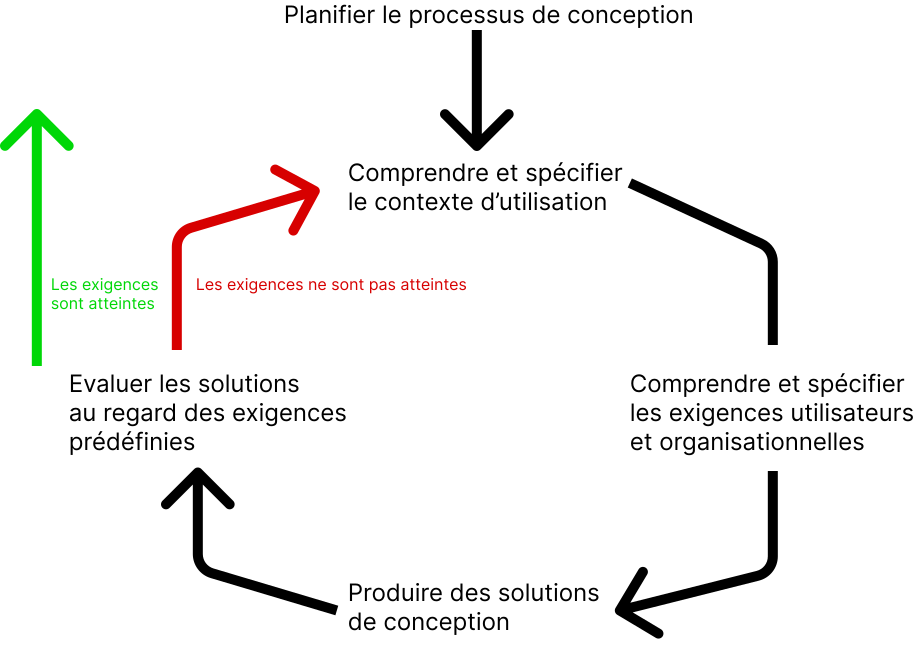

<section class="slide--section">

  

    <h1 class="r-fit-text">Conception centrée utilisateur</h1>
    
<em>IND8412A - Expérience utilisateur pour le Web</em>

  

  

</section>

---

<ol class="toc">
  <li>Statistiques d'utilisation du Web</li>
  <li>ISO 9241-210</li>
  <li>Méthodologie agile</li>
</ol>

---

<section>

<h2>Utilisation du web au Québec et dans le monde</h2>

  

    
<strong>Ressources :</strong>

    <ul>
      <li><a href="https://datareportal.com/reports/digital-2026-canada">Data Report Canada 2026</a></li>
      <li><a href="https://datareportal.com/reports/digital-2026-global-overview-report">Data Report Global 2026</a></li>
      <li><a href="https://transformation-numerique.ulaval.ca/enquetes-et-mesures/netendances/portrait-numerique-des-regions-2024/">Portrait numérique des régions au Québec 2024</a></li>
    </ul>
  

</section>

---

<section>

<h2>Utilisation du Web</h2>

  

    
<strong>Part des usagers (2009 !!) :</strong>

    <ul>
      <li>Créateur : 24%</li>
      <li>Causeur : 33%</li>
      <li>Critique : 37%</li>
      <li>Collectionneur : 20%</li>
      <li>Social: 59%</li>
      <li>Spectateur : 70%</li>
      <li>Inactif : 17%</li>
    </ul>
  

  

    
    
<a href="https://wearesocial.com/uk/blog/2010/01/social-technographics-ladder/">Social Technographics Ladder</a>

  

<aside class="notes">
Inclus les usagers qui participent au moins une fois par mois aux activités indiqués.
</aside>

</section>

---

<section>

<h2>Il y a plus d'1.2 milliard de sites web…</h2>

  

    
<strong>Source :</strong> <a href="https://www.worldwidewebsize.com/">worldwidewebsize.com</a>

    <ul>
      <li>17% de ces sites sont actifs, 83% sont inactifs</li>
      <li>252,000 nouveaux sites web sont créés chaque jour</li>
      <li>3 nouveaux sites web sont créés chaque seconde</li>
    </ul>
  

</section>

---

<section>

<h2>D'un point de vue économique</h2>

  

    <ul>
      <li>Période de prospérité économique du milieu des années 1990.</li>
      <li>Nombreuses entreprises créées, multitude de services en ligne et prolifération des sites Web.</li>
      <li>C'est l'apparition de l'aire du dot.com</li>
    </ul>
  

</section>

---

<section class="slide--section">
  

  <h1 class="r-fit-text">La norme ISO 9241-210</h1>
  
<em>Conception centrée sur l'opérateur humain</em>

</section>

---

<section>

<h2>La norme ISO 9241</h2>

  <ul>
    <li>ISO 9241</li>
    <li>Ergonomie de l'interaction homme-système</li>
  </ul>
  

</section>

---

<section>

<h2>La norme ISO 9241-210</h2>

  <ul>
    <li>Part 210: Conception centrée sur l'être humain pour les systèmes interactifs.</li>
  </ul>
  

</section>

---

<section>

<h2>La norme ISO 9241-210</h2>
<h3>Cinq grands principes</h3>

  

    <ul>
      <li>La prise en compte en amont des utilisateurs, de leurs tâches et de leur environnement</li>
      <li>La participation active des utilisateurs, garantissant la fidélité des besoins et des exigences liées à leurs tâches</li>
      <li>La répartition appropriée des fonctions entre les utilisateurs et la technologie</li>
      <li>L'itération des solutions de conception jusqu'à la satisfaction des besoins et des exigences exprimés par les utilisateurs</li>
      <li>L'intervention d'une équipe de conception multidisciplinaire, centrée sur l'expérience utilisateur</li>
    </ul>
  

<aside class="notes">
9241 fournit des exigences et des recommandations relatives aux principes et aux
activités de conception centrée sur l'opérateur humain, intervenant tout au long du cycle
de vie des systèmes informatiques interactifs.
annule et remplace la norme ISO 13407
</aside>

</section>

---

<section>

<h2>La norme ISO 9241-210</h2>

  

</section>

<aside class="notes">
Principale différence :
Étape 1 : Orientation descriptive → Étudier et décrire le contexte global.
Étape 2 : Orientation prescriptive → Définir des objectifs et exigences à partir des informations recueillies dans l'étape 1.
</aside>

</section>

---

<section>

<h2>Revue de la norme</h2>
<h3>Les phases</h3>

  

    
<strong>Planification</strong>

    <ul>
      <li>Planifier la mise en oeuvre de la démarche de conception</li>
      <li>Définir les plans techniques, méthodologiques, et de conduite de projet</li>
    </ul>
    
<strong>Spécification du contexte d'utilisation :</strong>

    <ul>
      <li>La population cible et ses caractéristiques</li>
      <li>Ses buts</li>
      <li>Son contexte</li>
    </ul>
  

</section>

---

<section>

<h2>Revue de la norme</h2>
<h3>Les phases</h3>

  

    
<strong>Spécification des exigences liées à l'utilisateur et à l'organisation :</strong>

    
prise en compte des besoins, des objectifs et des attentes des utilisateurs du système (incluant l'organisation/commanditaire).

    
<strong>Conception :</strong>

    
Utiliser les connaissances pour conceptualiser les solutions. 

    
développement de prototypes

  

</section>

---

<section>

<h2>Revue de la norme</h2>
<h3>Les phases</h3>

  

    
<strong>Évaluation de la ou des solutions conçues :</strong>

    
évaluation en fonction des exigences documentées aux étapes précédentes.

    
<strong>On mesure :</strong>

    <ul>
      <li>La performance du système à répondre aux attentes et aux besoins des utilisateurs</li>
      <li>Le niveau de satisfaction</li>
    </ul>
    
Sur la base des résultats obtenus, on apporte des modifications au prototype que l'on va retester selon une approche itérative.

  

<aside class="notes">
Lors de cette dernière phase, il est préférable de définir des besoins et des exigences à
satisfaire sous la forme de mesures qualitatives et quantitatives telles que :
Le taux de succès pour la réalisation des tâches à effectuer
Le nombre d'erreurs effectuées (et éventuellement les contournements réalisés)
Le temps d'exécution de chaque tâche (et éventuellement, les différences de temps pour
une même tâche répétée)
Le nombre d'étapes nécessaires à la complétion de la tâche
Le recours éventuel à un support ou une aide interne ou externe au produit (ex :
l'animateur de la session de test)
Le rythme d'apprentissage
La satisfaction des utilisateurs…
</aside>

</section>

---

<section>

<h2>UX designer – Tâches et fonctions</h2>

  

    
La définition de Don Norman nous dit que l'UX Design englobe toutes les interactions entre un utilisateur potentiel ou existant et une entreprise.

    
Le UX designer réfléchit à la façon dont l'utilisateur se sent et à la facilité avec laquelle il peut accomplir les tâches qu'il souhaite.

  

</section>

---

<section>

<h2>UI designer – Tâches et fonctions</h2>

  

    
Le UI designer est un terme lié aux interfaces digitales.

    
Son rôle est de tenir compte de l'apparence, de la sensation et de l'interactivité du produit. Il s'agit de s'assurer que l'interface utilisateur d'un produit est aussi intuitive que possible, ce qui implique d'examiner attentivement chaque élément visuel et interactif que l'utilisateur peut rencontrer.

  

</section>

---

<section>

<h2>UI designer – Tâches et fonctions</h2>

  

    <ul>
      <li>Concevoir pour guider visuellement l'utilisateur à travers l'interface d'un produit.</li>
      <li>Créer une expérience intuitive</li>
      <li>Transférer les points forts et les « assets » visuels de la marque à l'interface d'un produit, en s'assurant que le design est cohérent, homogène et esthétiquement agréable.</li>
    </ul>
  

</section>