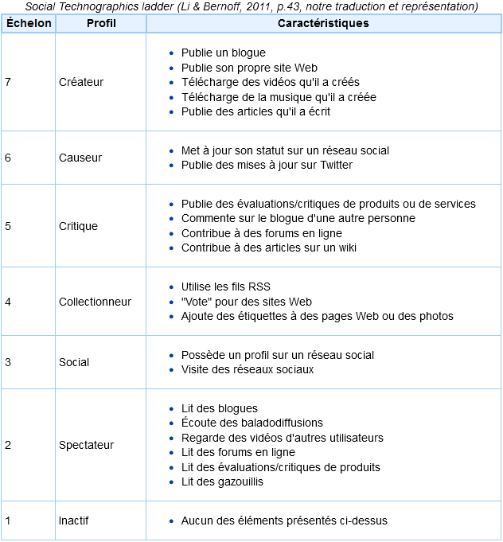

# 2

## Benjamin Berton – IND8412A Expérience utilisateur pour le Web

---

## Statistiques d’utilisation du Web
- 01
- 02
- 03
- Histoire du Web
- Rappel d’ergonomie

---

<section>

<h2>Utilisation du web au Québec et dans le monde</h2>

  

    
<strong>Ressources :</strong>

    <ul>
      <li><a href="https://datareportal.com/reports/digital-2026-canada">Data Report Canada 2026</a></li>
      <li><a href="https://datareportal.com/reports/digital-2026-global-overview-report">Data Report Global 2026</a></li>
      <li><a href="https://transformation-numerique.ulaval.ca/enquetes-et-mesures/netendances/portrait-numerique-des-regions-2024/">Portrait numérique des régions au Québec 2024</a></li>
    </ul>
  

</section>

---
<section>

<h2>Utilisation du Web</h2>

  

    
<strong>Part des usagers (2009 !!) :</strong>

    <ul>
      <li>Créateur : 24%</li>
      <li>Causeur : 33%</li>
      <li>Critique : 37%</li>
      <li>Collectionneur : 20%</li>
      <li>Social: 59%</li>
      <li>Spectateur : 70%</li>
      <li>Inactif : 17%</li>
    </ul>
  

  

    
    
<a href="https://wearesocial.com/uk/blog/2010/01/social-technographics-ladder/">Social Technographics Ladder</a>

  

Note: Inclus les usagers qui participent au moins une fois par mois aux activités indiqués.
</section>

---

<section>

<h2>Il y a plus d'1.2 milliard de sites web…</h2>

  

    
<strong>Source :</strong> <a href="https://www.worldwidewebsize.com/">worldwidewebsize.com</a>

    <ul>
      <li>17% de ces sites sont actifs, 83% sont inactifs</li>
      <li>252,000 nouveaux sites web sont créés chaque jour</li>
      <li>3 nouveaux sites web sont créés chaque seconde</li>
    </ul>
  

</section>

---

<section>

<h2>D'un point de vue économique</h2>

  

    <ul>
      <li>Il y a eu la période de prospérité économique du milieu des années 1990. Les investisseurs disposaient alors d'importants capitaux à investir</li>
      <li>De nombreuses entreprises ont été créées, donnant naissance à une multitude de services en ligne et, du même coup, à une prolifération des sites Web</li>
      <li>C'est l'apparition de l'aire du dot.com</li>
    </ul>
  

    

</section>

---

<!-- .slide: class="toc" -->
## Projet #1
| | |
|---:|---|
| 01 | ISO 9241-210 |
| 02 | Les acteurs de la conception |
| 03 | Méthodologie agile |

---

## La norme ISO 9241-210

- ISO 9241-210:2019
- Ergonomics of human-system interaction
- Part 210: Human-centred design for interactive systems

---

## La norme ISO 9241-210

- Cinq grands principes
- La prise en compte en amont des utilisateurs, de leurs tâches et de leur environnement
- La participation active des utilisateurs, garantissant la fidélité des besoins et des exigences liées à leurs tâches
- La répartition appropriée des fonctions entre les utilisateurs et la technologie
- L’itération des solutions de conception jusqu’à la satisfaction des besoins et des exigences exprimés par les utilisateurs
- L’intervention d’une équipe de conception multidisciplinaire, centrée sur l’expérience utilisateur

Note:
9241 fournit des exigences et des recommandations relatives aux principes et aux
activités de conception centrée sur l'opérateur humain, intervenant tout au long du cycle
de vie des systèmes informatiques interactifs.
annule et remplace la norme ISO 13407

---

## Planifier le processus de conception
### FIN
Comprendre et specifier le contexte d’utilisation
- Les exigences sont atteintes
- Les exigences ne sont pas atteintes
Evaluer les solutions au regard des exigences prédéfinies
Comprendre et specifier les exigences utilisateurs et organisationnelles
Produire des solutions de conception

Note:
Principale différence :
Étape 1 : Orientation descriptive → Étudier et décrire le contexte global.
Étape 2 : Orientation prescriptive → Définir des objectifs et exigences à partir des informations recueillies dans l'étape 1.

---

## Revue de la norme

- ISO 9241-210 : Les phases
- Planification
- Planifier la mise en oeuvre de la démarche de conception
- Définir les plans techniques, méthodologiques, et de conduite de projet
- Spécification du contexte d’utilisation
- La population cible et ses caractéristiques
- Ses buts
- Ses environnements
- Les données nécessaires sont souvent recueillies au moyen d’entretiens et d’observations auprès d’utilisateurs cibles

---

## Revue de la norme

ISO 9241-210 : Les phases
Spécification des exigences liées à l'utilisateur et à l'organisation: Il s'agit de prendre en compte:
les besoins
les objectifs
les attentes de tous les utilisateurs du système (incluant l'organisation/commanditaire).
Conception :
Il s'agit d'utiliser les connaissances acquises lors des étapes précédentes pour conceptualiser les solutions. Cette phase se traduit par le développement de prototypes que l'on peut visualiser, manipuler et tester.
Voici certains éléments du système qui seront développés : les schémas d'interfaces, les fonctionnalités, la navigation, les styles d'interaction, les dispositifs d'entrée/sortie, le soutien à l'utilisateur, etc..

---

## Revue de la norme

ISO 9241-210 : Les phases
Évaluation de la ou des solutions conçues :
Cette étape vise à évaluer les solutions conçues en fonction des exigences documentées aux étapes précédentes. Dans cette phase, les utilisateurs finaux sont impliqués.
On mesure:
la performance du système à répondre aux attentes et aux besoins des utilisateurs en matière d'ergonomie,
le niveau de satisfaction.
Sur la base des résultats obtenus, on apporte des modifications au prototype que l'on va retester selon une approche itérative.

Note:
Lors de cette dernière phase, il est préférable de définir des besoins et des exigences à
satisfaire sous la forme de mesures qualitatives et quantitatives telles que :
Le taux de succès pour la réalisation des tâches à effectuer
Le nombre d'erreurs effectuées (et éventuellement les contournements réalisés)
Le temps d'exécution de chaque tâche (et éventuellement, les différences de temps pour
une même tâche répétée)
Le nombre d'étapes nécessaires à la complétion de la tâche
Le recours éventuel à un support ou une aide interne ou externe au produit (ex :
l'animateur de la session de test)
Le rythme d'apprentissage
La satisfaction des utilisateurs…

---

## Les acteurs dans la conception de projets WEB

---

## La genèse de la notion de conception
- Jusqu’à la renaissance
- Révolution industrielle
- Domaine de l’artisan
- Rôles d’idéation et de fabrication
- L’organisation scientifique du travail , séparation des rôles de conception et d’exécution
- Dans les années 1830
- 1900-1920
Les courtiers d’annonces apparaissent. A cette époque, les annonceurs rédigeaient eux-mêmes leurs annonces (Gaertner, 2008)
La spécialisation des métiers de conception ne viendra qu’avec la diversification des supports publicitaires (affiches, cinéma, radio) (Gaertner, op.cit.)

---

## La genèse de la notion de conception
### L’acte de conception, un duo créatif
Les courtiers s’effacent progessivement au profit des agences de publicité.
La création des publicités consiste à imaginer une idée et à la mettre en images et en mots. C’est le travail de l’équipe de création (“creative team”) composée d’un Directeur Artistique (DA) et d’un Concepteur Rédacteur (CR) (Gaertner, Op.Cit.)
Après la Grande Guerre
- Depuis 1960
- Le marketing fait son apparition. Son rôle est de prédire les tendances des marchés.
- (Lendrevie et Lindon, 1990).
- Le chef de publicité, au départ polyvalent, se centre sur la gestion de la relation avec l’annonceur et la réflexion stratégique.
D’un duo créatif à une action pluridisciplinaire

---

## La genèse de la notion de conception
### Intégration de l’ergonome dans la démarche de conception
- 1857
- 1949
- 1982
- 1995-2000
- La communauté de recherche s’organise en Europe autour de la notion d’ergonomie cognitive mise en avant par Thomas Green et Gerrit Van der Veer.
- L’ergonomie fait son apparition dans les agences de communication avec « l’économie numérique » (Lazonick, 2007)
- Le mot ergonomie a été créé par l’ingénieur Polonais Wojciech Jastrzebowski.
- Le mot ergonomie a été redécouvert par l’ingénieur et psychologue anglais Hywell Murrel

Note:
C'est dans les années 1850 que le terme "ergonomie" est créé par le biais de la publication du "Précis d'Ergonomie" par Wojciech Jastrzebowski (Polonais).

Murell réinvente le terme une décennie après . L’ergonomie est l’étude scientifique des relations entre l’homme et son environnement de travail. Murell est considéré comme le père fondateur.

En 1949, lors de la première réunion de l'Ergonomics Research Society, avec l'intervention refondatrice de l'ingénieur et psychologue gallois Keith Frank Hywel Murell (1908-1984).Cette société est à l'origine de la création de l'International Ergonomics Association (IEA) qui tient son premier congrès à Oxford en 1961.

Thomas Green, Gerrit van der Veer et quelques autres collègues organisent la première conférence européenne en EC à Amsterdam: « Mind and Computers ».

---

## Les acteurs

- Pourquoi parler des acteurs du processus ?
- Afin de mieux comprendre le travail du reste de l’équipe
- Afin de mieux connaître ce que les autres attendent de notre propre travail
- Afin de collaborer avec tous les intervenants de façon plus harmonieuse.

---

## L’ergonome d’interface

---

## Les acteurs – Ergonome d’Interface
Rôles: Selon Jordan (2000), les ergonomes des interfaces sont les acteurs du processus de conception chargés de l’ensemble des éléments relatifs à la valeur d’usage du produit.
Leur équipe de travail: Les ergonomes sont souvent rattachés à la Direction de création ou à la Direction de la communication. Les ergonomes des interfaces peuvent soit travailler comme consultant dans un cabinet, soit comme travailleur indépendant, soit comme membre intégré à l’équipe projet dans de grandes entreprises.
La formation requise: Selon l’Association Canadienne d’Ergonomie, en référence à leur site Web, « la formation de l’ergonome peut grandement varier étant donné que l’ergonomie couvre un vaste champ d’application.
« Bien que l’ergonome puisse être détenteur d’un diplôme en psychologie, ingénierie, informatique, etc., cette formation en soi n’est pas suffisante pour s’attribuer le titre d’ergonome. L’ergonome doit suivre divers cours universitaires, qui couvrent plusieurs champs de connaissances de l’ergonomie » l’Association Canadienne d’Ergonomie.

---

## Le Concepteur-Rédacteur

---

## Les acteurs – Concepteur Rédacteur
Rôles: Les CR sont non seulement en charge du message, des textes ou des dialogues, mais ils ont aussi des acteurs importants dans la phase d’élaboration des concepts.
Leur équipe de travail: Les CR dépendent généralement d’un directeur de création. Les CR peuvent également travailler comme consultants indépendants (« freelance »).
La formation requise: Variée. On mentionne généralement une formation universitaire en communication, en journalisme ou en art.

---

## Le Directeur Artistique (DA)

---

## Les acteurs – Directeur Artistique
Rôles: responsables des éléments relatifs à la valeur d’estime du produit. Ils sont responsables de l’intégration des attentes de l’utilisateur, de la cohérence esthétique, ainsi que des émotions, du plaisir et de la qualité perçue par l’utilisateur (Quarante, 2001).
Leur équipe de travail: les DA web dépendent d’un directeur de création qui est plus en amont sur la réflexion créative. Les DA peuvent également exercer leur métier en tant que consultant indépendant (« freelance »).
La formation requise: DEC ou baccalauréat en design graphique.

---

## Planifier le processus de conception
### Produire des solutions de conception
| Développer la stratégie | Participer au développement du plan stratégique |  |  |  |  |  |  |  |
| --- | --- | --- | --- | --- | --- | --- | --- | --- |
| Analyser la faisabilité | Evaluer les exigences |  |  |  |  |  |  |  |
| Elaborer la structure du site | Définir le contenu et les fonctionnalités | Mener un audit de contenu | Organiser des séances de tris de carte | Développer l’architecture d’information |  |  |  |  |
| Analyser le contexte d’usage | Faire une analyse de la compétition | Faire une analyse des besoins | Faire une analyse des tâches | Analyser les données analytiques | Effectuer une recherche utilisateur | Faire les groupes de discussions | Développer les scénarios utilisateurs | Développer les personae |
- FIN
- Comprendre et specifier le contexte d’utilisation
- Les exigences sont atteintes
- Les exigences ne sont pas atteintes
- Evaluer les solutions au regard des exigences prédéfinies
- Comprendre et specifier les exigences utilisateurs et organisationnelles
- De l’ergonome d’interface en phase de recherche

---

## Planifier le processus de conception
### De l’ergonome d’interface en phase de conception
| Exploration | Idéation | Elaborer les critères d’acceptations et de performances |  |  |  |  |
| --- | --- | --- | --- | --- | --- | --- |
| Rédiger la documentation de conception | Rédiger les spécifications d’interfaces |  |  |  |  |  |
| Elaborer les interfaces utilisateur | Identifier les pages types | Développer les systèmes de navigations | Développer les schémas d’interfaces | Développer les schémas d’interfaces | Développer les diagrammes de flux | Développer les prototypes fonctionnels |
- FIN
- Comprendre et specifier le contexte d’utilisation
- Les exigences sont atteintes
- Les exigences ne sont pas atteintes
- Evaluer les solutions au regard des exigences prédéfinies
- Comprendre et specifier les exigences utilisateurs et organisationnelles
Produire des solutions de conception

---

## Planifier le processus de conception
### Produire des solutions de conception
| Exploration | Développer les « Moodboard » |  |  |  |  |
| --- | --- | --- | --- | --- | --- |
| Idéation | Elaborer les concepts créatifs | Crayonner |  |  |  |
| Elaborer les interfaces utilisateur | Elaborer les systèmes de navigation | Développer les schémas d’interfaces | Faire le choix stylistique | Développer les maquettes graphiques | Développer l’argumentaire créatif |
| Décliner les maquettes graphiques | Sélectionner les artistes (photographe, réalisateur, compositeur,…) | Diriger les ressources externes |  |
| --- | --- | --- | --- |
| Développer la charte graphique | Assurer la synergie et la cohérence multiplateforme | Prendre les photos des produits | Faire la direction artistique des vidéos |
- Du directeur artistique en phase de conception
- FIN
- Comprendre et specifier le contexte d’utilisation
- Les exigences sont atteintes
- Les exigences ne sont pas atteintes
- Evaluer les solutions au regard des exigences prédéfinies
- Comprendre et specifier les exigences utilisateurs et organisationnelles

---

## Planifier le processus de conception
### Du concepteur-rédacteur en phase de conception
| Exploration | Elaborer des concepts créatifs | Développer l’argumentaire créatif |  |
| --- | --- | --- | --- |
| Elaborer le contenu | Développer la ligne éditoriale, choix stylistique | Développer la structure des textes | Développer les titres de sections et les accroches |
| Elaborer les interfaces utilisateurs | Ajuster les wireframes basés sur le contenu | Rédiger les spécifications utilisateurs | Faire le choix stylistique |
| Concevoir, rédiger les textes | Optimiser le contenu pour répondre au Search Engine Optimization (SEO) | Déterminer la longueur des textes | Produire les « Copydeck » |  |
| --- | --- | --- | --- | --- |
|  | Adapter le contenu à la langue cible | Réviser les textes | Adapter le contenu existant | Développer le calendrier rédactionnel |
- FIN
- Comprendre et specifier le contexte d’utilisation
- Les exigences sont atteintes
- Les exigences ne sont pas atteintes
- Evaluer les solutions au regard des exigences prédéfinies
- Comprendre et specifier les exigences utilisateurs et organisationnelles
Produire des solutions de conception

---

## Planifier le processus de conception
### Produire des solutions de conception
| Validation utilisateur | Développer le protocole et conduire la validation utilisateur | Déterminer la longueur des textes |
| --- | --- | --- |
| Faire le suivi | AQ/ rétroaction design | Faire les diagnostiques |
| Faire les diagnostiques | Réaliser l’évaluation heuristique ou experte | Conduire les audits d’accessibilité |
- FIN
- Comprendre et specifier le contexte d’utilisation
- Les exigences sont atteintes
- Les exigences ne sont pas atteintes
- De l’ergonome d’interface en phase de validation
- Evaluer les solutions au regard des exigences prédéfinies
- Comprendre et specifier les exigences utilisateurs et organisationnelles

---

## Détail des activités

---

## Groupe de discussion

- Les participants recrutés sont représentatifs des utilisateurs réels et potentiels.
- Les séances sont en groupe de 6 à 8 personnes
- Les séances se font dans un environnement contrôlé ou une salle de réunion.

---

## Activité – Ergonome d’interface

Exemple d’un modèle de la tâche prescrite développé à partir de la documentation (Checklist, manuel standard des opérations de la compagnie), d’entretiens avec des experts, et d’observations en simulateur (Li et al., 2022)

---

## Activité – Ergonome d’interface
| Lien | Type de contenu | Objectif du contenu | Qualité | Clarté | Pertinence | Accessibilité | Commentaires |
| --- | --- | --- | --- | --- | --- | --- | --- |
| /accueil | Texte + Images | Accueillir les utilisateurs et présenter le service | 4/5 | Bonne | Pertinent | Accessible (ALT sur images) | Le contenu est clair, mais la bannière est trop grande sur mobile. |
| /recherche-biens | Formulaire | Permettre aux utilisateurs de rechercher des biens | 3/5 | Moyenne | Très pertinent | Partiellement accessible | Le champ "budget" manque un label explicite. Améliorer la compatibilité clavier. |
| /article-5-conseils-achat | Article de blog | Informer et éduquer sur le processus d’achat | 5/5 | Très claire | Pertinent | Accessible | Article bien structuré avec des titres H2 et des listes à puces lisibles. |

---

## Activité – Ergonome d’interface

- Analyse des écarts
- Achat d’une maison existante par un acheteur expérimenté

---

## Activité – Ergonome d’interface

---

## Activité – Ergonome d’interface

---

## Activité – Ergonome d’interface

---

## Activité – Ergonome d’interface

---

## Test utilisateur
### Les passations :

Les participants recrutés sont représentatifs des utilisateurs réels et potentiels.
- Experimentation room
- Observation room
- TV
- Videoprojector screen
- Observators
- Biograph
- Infiniti
- Observator
- Observation Usability expert screen
- Les séances sont individuelles (afin de garantir une information mesurable non contaminée).
- ProComp Infiniti
- One way mirror
- User
- Tobii T 120
- Facilitator Usability expert
- Control monitor
- Les séances se font dans un environnement contrôlé, en milieu de travail ou encore en mode « guérilla » .

---

## Test utilisateur – les outils

---

## Activité – Ergonome d’interface

---

## Activité – Ergonome d’interface

---

## Moodboard / planche de tendance

- Activité – Directeur Artistique
- Moodboard / planche de tendance

---

## Activité – Directeur Artistique

---

## Activité – Directeur Artistique

- Guide graphique
- Design system

---

## Guide graphique / design system

---

## Guide graphique / design system

---

## Activité – Concepteur-Rédacteur
- La ligne éditoriale représente l'ensemble des choix et décisions que fait un comité de rédaction.
- Prenons l’exemple d’une entreprise qui souhaite vendre des planchers de bois écologiques compatibles avec des planchers chauffants.
- Cible : Des consommateurs impliqués.
- Ils cherchent des produits respectueux de l’environnement et sont prêts à faire des concessions financières.
- Ton:
- Engagé, respectueux, pédagogique, honnête.
- Types de clients:
- Les consommateurs verts, qui font ce choix par conviction.
- Les “pragmatiques”, qui veulent faire des économies d’électricité.
- Mots-clés :
- Plancher de bois naturel Plancher bio
- Plancher écologique

---

## Constats
- Les DA, les CR et les EI ne sont pas sollicités aux mêmes phases de la démarche de conception:
- Les DA sont majoritairement sollicités durant les phases de conception et de production
- Les CR sont sollicités durant les mêmes phases de conception et de production
- Les EI sont sollicités majoritairement durant les phases de planification , de conception et de validation

---

## Pour le DA
- Produit final qui ne correspond pas aux maquettes
- Ambiguïté concernant la personne qui doit trancher en cas de désaccords
- Peur de l’innovation (reproche faite aux EI)

---

## Pour le CR
- Implications tardives dans le processus.
- Trop souvent, on est en réaction, pas assez en réflexion.
- Ambiguïté concernant la personne qui doit t rancher en cas de désaccords.

---

## Pour les EI
- Avant tout, manque de compréhension du métier d’ergonome.
- Implication tardive dans le processus.
- Parfois, la créativité ou l’innovation prend le dessus sur la pertinence envers la cible. (DA et CR)
- Parfois, les schémas d’ interfaces ne sont pas respectés. (DA)
- Ambiguïté concernant la personne qui doit t rancher en cas de désaccords.

---

## Pour les EI
- Définition imprécise des rôles de chacun
- Absence de consensus des «allant- de- soi »
- Non reconnaissance du domaine d’expertise de chacun (incluant les livrables développés)
- Absence de langage commun
- Mauvaise compréhension du service à fournir au client
- Imprécision du mécanisme décisionnel.

---

## DA, CR, EI
- Nous pouvons définir un domaine d’expertise pour chacun des professionnels ciblés par ce projet:
- Le DA est principalement expert des éléments relatifs à la valeur d’estime (cohérence esthétique, émotions, plaisirs, qualités perçus par l’utilisateur)
- Le CR est principalement expert des éléments relatifs à la sémiotique (le “storytelling”).
- L’EI est principalement expert des éléments relatifs à la fonction d’usage du produit (y compris la validation utilisateur)

---

## DA, CR, EI
- La collaboration peut être compliqué et pourtant la démarche de conception nécessite un travail multidisciplinaire
- La pertinence d’une co-conception négociée est constatée
- Définir les rôles distinctifs de chacun (ou domaine d’activité) et le partage à chacune des phases
- Définir les “allants-de-soi” et convenir de présupposés consensuels
- Etablir un langage commun
- Reconnaître l’expertise de chacun
- Clarifier les mécanismes de décisions

Note:
Les personnes qui appartiennent à des disciplines ou des professions différentes pratiquent l’interdisciplinarité si elles partagent leurs points de vue et leurs expertises, se transmettent de l’information, se consultent, travaillent ensemble particulièrement au sein d’une équipe.

---

## Autre structure

---

## UX designer – Tâches et fonctions
La définition de Don Norman nous dit que l’UX Design englobe toutes les interactions entre un utilisateur potentiel ou existant et une entreprise.
Le UX designer réfléchit à la façon dont l ' utilisateur se sent et à la facilité avec laquelle il peut accomplir les tâches qu' il souhaite.

---

## UI designer – Tâches et fonctions
Le UI designer est un terme lié aux interfaces digitales.
Son rôle est de tenir compte de l'apparence, de la sensation et de l'interactivité du produit. Il s'agit de s'assurer que l'interface utilisateur d'un produit est aussi intuitive que possible, ce qui
implique d'examiner attentivement chaque élément visuel et interactif que l'utilisateur peut rencontrer. Un concepteur d'interface utilisateur pensera aux icônes et aux boutons, à la typographie et aux combinaisons de couleurs, à l'espacement, à l'imagerie et à un design réactif (responsive).

---

## UI designer – Tâches et fonctions
Concevoir pour guider visuellement l'utilisateur à travers l'interface d'un produit.
Créer une expérience intuitive
Transférer les points forts et les « assets » visuels de la marque à l'interface d'un produit, en s'assurant que le design est cohérent, homogène et esthétiquement agréable.

---

## Survol de la méthodologie agile

L E S A P P R O C H E S V A L E U R S E T D I F F C U L T É E S
S o u r c e : 2010_Jean-Francois Proulx (1)
I n t é g r e r u n e a p p r o c h e d e c o n c e p t i o n c e n t r é e u t i l i s a t e u r à u n e a p p r o c h e a g i l e de d é v e l o p p e m e n t l o g i c i e l

---

## Les valeurs
- Les valeurs du mode agile: l’équipe, le logiciel fonctionnel, la collaboration et l’acceptation du changement
- Les individus et les interactions plutôt que les processus et les outils
- Les fonctionnalités opérationnelles plutôt qu’une documentation exhaustive
- La collaboration avec le client plutôt que la négociation de contrat
- La réponse au changement plutôt que le suivi d’un plan

---

## Les 12 principes
SATISFAIRE LE CLIENT: La plus haute priorité est de satisfaire le client en lui livrant rapidement, et ce, de façon continue, un logiciel de qualité.
ACCEPTATION DU CHANGEMENT: Accepter les changements de besoins, même lors du développement. Les processus agiles exploitent les changements pour augmenter les avantages compétitifs du client.
LIVRAISON DE VERSIONS FONCTIONNELLES: Livrer fréquemment un logiciel fonctionnel en visant les délais les plus courts, de quelques semaines à quelques mois.
ASSURER UNE COOPÉRATION: Gestionnaires et développeurs doivent travailler ensemble, de façon quotidienne, pour toute la durée du projet.
INDIVIDUS MOTIVÉS: Bâtir des projets autour d'individus motivés. Donnez-leur l'environnement et le support dont ils ont besoin, et ayez confiance qu'ils feront le travail.

---

## Les 12 principes (suite)
CONVERSATION FACE À FACE: La méthode la plus efficace pour transmettre l'information à l'équipe de développement et à l'intérieur de celle-ci est par la conversation de personne à personne.
MESURE DE L’AVANCEMENT: Un logiciel fonctionnel est la mesure principale de l'avancement.
RYTHME SOUTENABLE: Les processus agiles favorisent le développement durable. Les responsables, développeurs et utilisateurs devraient pouvoir conserver un rythme constant indéfiniment.
EXCELLENCE TECHNIQUE : Une attention continue à l'excellence technique et une bonne conception augmentent l'agilité.

---

## Les 12 principes (suite et fin)
LA SIMPLICITÉ: l'art de minimiser la quantité de travail fait inutilement – est essentielle.
RESPONSABILISER LES ÉQUIPES: Les meilleures architectures, exigences et conceptions surgissent d'équipes autoorganisées.
AJUSTER LES INTERVALLES : À intervalles réguliers, l'équipe réfléchit à une façon de devenir plus efficace, puis adapte et ajuste son comportement en conséquence.

---

## Les approches
Les approches agiles sont un ensemble de pratiques de développement itératif et incrémental de logiciel, misant sur des courts cycles de développement, afin de concevoir rapidement des solutions informatiques ayant de la valeur pour le client.
Scrum (1996)
Rapid applications developpement (RAD, 1991)
Intégration continue (1991)
Dynamic systems development (DSDM, 1995)
Extreme programming (XP, 1999)
Adaptative software development (ASD, 2000)
Feature driven development (DFF, 2003)
Crystal clear (2004)
…

Note:
RAD 3 phases (Cadrage, Design et Construchon) dans un délai idéal de 90 jours et de 120 jours au maximum.
XP Les équipes de développement travaille directement avec le client sur des cycles très courts d'une à deux semaines maximum
Le code est testé et nejoyé tout au long du processus de développement.

---

## SCRUM
Scrum est une des principales approches agiles de gestion et de suivi d’avancement de projets. Le terme Scrum provient de la mêlée au rugby pour symboliser l’équipe qui travaille de manière auto organisée et qui s'adapte selon la situation de jeu.
Un représentant du client nommé propriétaire du produit (product owner) est responsable de transmettre à l’équipe l’orientation du projet, de définir les fonctionnalités et de suggérer l’ordre dans lequel elles devraient être développées par l’équipe afin de fournir un logiciel qui a de la valeur pour lui.
Il exécute ceci dans le carnet de produit (product backlog).
DONC Le carnet de produit est une liste d'éléments, représentant des besoins ou fonctionnalités désirées par le propriétaire du produit.

---

## SCRUM
Les éléments y sont classés selon la valeur d'affaire accordée par le propriétaire du produit.
La valeur accordée aux éléments par le propriétaire dépend des critères qu'il considère : le retour sur investissement (ROI), la criticité d'une fonctionnalité dans le système ou pour les utilisateurs, le coût en effort de développer la fonctionnalité, etc.
Le travail de développement est découpe en itérations (sprints) qui ont généralement une durée de trois ou quatre semaines.

---

## SCRUM
### Crédit image: http://pyxis-tech.com/fr/approches-agiles/

---

## SCRUM – les composantes
Mêlée quotidienne (15 minutes): rencontre de 15 minutes où l'équipe fait un compte rendu de son avancement. Trois questions : qu'as-tu accompli depuis la dernière mêlée ? Que vas-tu accomplir jusqu’à la prochaine mêlée ? Est-ce que des éléments te bloquent dans ton avancement ?
Réunion de planification d'un Sprint (4-8 heures) : sert à décider des éléments du carnet du produit à traiter dans la prochaine itération, et comment s’organiser pour y parvenir.
Revue de sprint (4 heures) : se fait à la fin du cycle et permet au propriétaire du produit de prendre connaissance des fonctionnalités qui ont été développées durant l'itération.
Rétrospective du sprint (fin du sprint 3 heures) : L'objectif est d’inspecter l'itération précédente, afin de déterminer quels sont les éléments du processus de développement qui ont bien fonctionné et ceux qui sont à améliorer.

---

## Les différences
| Philosophie agile | Philosophie ergonomique |
| --- | --- |
| Comment améliorer le système au cours de cette itération | Quel est le système idéal (pour l’utilisateur) |
| Les détails de spécifications peuvent être identifiés juste à temps, durant la phase de développement (la conception détaillée en amont est risquée) | Les comportements du système doivent être identifiés en amont, avant le début de la phase de développement |
| Centrer la conception sur les besoins énoncés par le propriétaire du produit | Centrer la conception sur les besoins et les attentes de l’utilisateur |
| Miser sur des pratiques de conception technique de système | Mettre l’accent sur la conception d’un système qui peut être utilisé de manière efficiente |

---

## © Julie Saulnier, 2023.

- Su r v o l e d e l a M é t h o d o l o g i e a g i l e
- LES PROBLÈMES ET SOLUTIONS
- Problèmes
- Pas assez de temps pour la conception.
- Symptômes
- Les développeurs attendent les concepteurs.
- Solutions
- Séparer et mettre en parallèle la conception UX et les
- développements.
- Les objectifs de l’UX doivent être réduit et progressif.
- Prévoir des validations ergonomiques courtes.
- La qualité de la conception est en baisse.
- La conception n’est pas vérifié avec les clients.

---

<!-- .slide: class="section" -->
# 81
© Julie Saulnier, 2023.

---

| Problèmes | Symptômes | Solutions |
| --- | --- | --- |
| Pas assez de retours des utilisateurs | Les retours ne sont pas assez tôt. | Simplifier les processus de collecte des informations. |
|  | Pas de données pour décider. | Privilégier le RITE (Rapid iterative testing and evaluation), |
| Le produit n’est pas validé. |  |  |
| Problèmes | Symptômes | Solutions |
| --- | --- | --- |
| Le « client » agile détient peu de connaissance | Les utilisateurs finaux et les clients ne participent pas | Une ressource UX par équipe équipe agile. |
| Impossible d’obtenir l’adhésion du reste de l’équipe |  |  |
| Des décisions sont prises sans informations pour les soutenir |  |  |

---

## Pas de contrôle sur le calendrier de conception
- Su r v o l e d e l a M é t h o d o l o g i e a g i l e
- LES PROBLÈMESET SOLUTIONS
- Problèmes Symptômes
- L’expert UX n’est pas à plein temps L’expert UX passe son temps en avec une équipe agile. réunion au lieu de concevoir.
- Démoralisé par la baisse de la qualité de l’UX
- Solutions
- L’UX participe à la planification du cycle, en portant les retours utilisateurs appropriés.
- La conception une fois validée est transmise aux développeurs.
- Problèmes
- Pas de sprint, de cycle planifié pour l’amélioration
- Symptômes
- Un important arriéré
- de fonctionnalités / bugs non traités.
- Priorisation des retours ignorés.
- Solutions
- Aucune fonctionnalité ne doit être abandonnées.

---

## Su r v o l e d e l a M é t h o d o l o g i e a g i l e
- Su r v o l e d e l a M é t h o d o l o g i e a g i l e
- LES PROBLÈMES ET SOLUTIONS
- Problèmes Symptômes
- Les retours utilisateurs sont ignorés Les fonctionnalités sont
- coulées dans le béton
Solutions
Aucun retour ne doit être ignoré. Les retours doivent être évalués et documentés. Le but est de les inscrire dans le backlog.
- Pas de temps pour intégrer les changements
- Aucune modification
- des fonctions n’est autorisée

---

## Su r v o l e d e l a M é t h o d o l o g i e a g i l e
| Problèmes | Symptômes | Solutions |
| --- | --- | --- |
| Communication pauvre | Concepts mal compris | Inclure les développeurs dans le processus de conception. |
|  | Les équipes agiles n’appliquent la conception. | Inclure les critères d’utilisabilité dans les conditions d’acceptation |
|  | Les informations importantes sont perdues. | Vérifier le progrès quotidiennement |
- Su r v o l e d e l a M é t h o d o l o g i e a g i l e
- LES PROBLÈMES ET SOLUTIONS

---

## Su r v o l e d e l a M é t h o d o l o g i e a g i l e
- Su r v o l e d e l a M é t h o d o l o g i e a g i l e
- LES PROBLÈMES ET SOLUTIONS
- Problèmes
- Manque d'une vue globale
- Symptômes
- Aucune vision commune
- Trop grande concentration sur les détails
- Solutions
- Convaincre l’équipe de compléter une itération de préparation
- Alléger le processus de collecte des exigences
- Difficulté à établir des priorités/ prendre des décisions de
- conception
- Raccourcir la portée des décisions à 1 ou 2 itérations d’ avance

---

## SCRUM – les composantes
DEUX PROPOSITIONS
Effectuer les activités d'ergonomie (planification/découverte) en pré-phase (cycle 0) au développementLa première proposition signifie que l'équipe d'ergonomes effectue du travail un ou plusieurs cycles avant que l'équipe de développement implémente les concepts ainsi réalisés, ceci afin que les développeurs puissent amorcer leur travail sur des concepts complets et validés.
Va à l’encontre du Mode agile : il n'est pas souhaitable de couvrir tous les aspects et faire ressortir toutes les spécifications d'un produit au début.
Les pratiques d'ergonomie permettent de cadrer la conception des interactions de l'utilisateur et du logiciel, et ce, à partir du point de vue de l'utilisateur et non en se basant sur des décisions d'implémentation
Effectuer les activités d'ergonomie à l'intérieur des itérations Scrum. Les ergonomes et les développeurs travaillent ensemble, durant chaque cycle du projet, à réaliser des concepts et à développer les fonctionnalités reliées à ces concepts.

---

## Survol de la méthodologie agile

---

## Survol de la méthodologie agile

---

## Source : https://www.gevme.com/blog/marrying-ux-design-and-development/

---

## Projet de cours

---

## SCRUM – les composantes
### Fait en équipe de 2 ou 3
- Vous devez faire la refonte d’un site ou d’une application Web. Ce projet sera divisé un
- 5 rendus et 1 oral. pour le premier travail de session vous allez devoir :
- Présenter le projet de refonte
- Identifier la cible
- Analysez les besoins
- Projet
- TRAVAIL DE SESSION
En annexe,
Les résultats de recherche pour l’analyse des besoins. (5-6 pages excluant les données de recherche en annexe)

---

| TP | Titre | Type | Date de remise | Contenu principal | Pondération principale |
| --- | --- | --- | --- | --- | --- |
| TP1
10% | Comprendre et spécifier le contexte d’utilisation | Groupe projet | 31 janvier 2025 | - Présentation du projet - Identification de la cible et ses caractéristiques - Analyse des besoins selon les données recueillies | Présentation (20%), Identification (35%), Analyse (35%), Langue et rigueur (10%) |
| TP2
20% | Évaluation heuristique | Individuel | 13 février 2025 | - Présentation des critères heuristiques utilisés - Résultats de l’évaluation : problèmes d’utilisabilité - Recommandations pour la reconception | Critères (20%), Résultats (35%), Recommandations (35%), Langue et rigueur (10%) |
| TP3
20% | Entretien utilisateur et tri de cartes | Groupe projet | 27 février 2025 | - Introduction et démarche scientifique - Recrutement des participants - Résultats : entretiens et tri de cartes - Nouvelle architecture d’information basée sur les résultats | Démarche (30%), Recrutement (10%), Résultats (30%), Architecture (20%), Langue et rigueur (10%) |
| TP4
20% | Création de prototypes pour la refonte | Groupe projet | 13 mars 2025 | - Introduction et présentation du projet - Flux de travail : parcours utilisateur - Schéma d’interfaces : prototypes basse fidélité - Spécifications d’interfaces | Présentation (10%), Flux (20%), Prototypes (20%), Spécifications (40%), Langue et rigueur (10%) |
| Oral 10% | Présentation orale du projet | Individuel | 17-28 mars | - Présentation du projet (3 min) - Présentation du prototype (12 min) - Questions (10 min) | Non précisé |
| TP5 20% | Test d’usage et synthèse finale | Groupe projet | 3 avril 2025
(extension possible jusqu’au 2 mai) | - Rapport : • Avancement du projet • Démarche méthodologique • Recrutement des utilisateurs • Synthèse des résultats • Conclusions et recommandations • Synthèse et bilan de groupe - Prototype testé : lien Figma ou copie numérique | Avancement (10%), Méthodologie (25%), Résultats (25%), Conclusions (20%), Bilan (10%), Présentation (10%) |

---

## En résumé
- 01
- 02
- 03
- ISO 9241-210
- Les acteurs de la conception
- Méthodologie agile

---
