<section class="slide--section">

  

<h1 class="r-fit-text">FusAIn – Composing Generative AI Visual Prompts Using
Pen-based Interaction</h1>

<em>Role: Historian • How fashion designers see GenAI tools • What came before FusAIn</em>

  

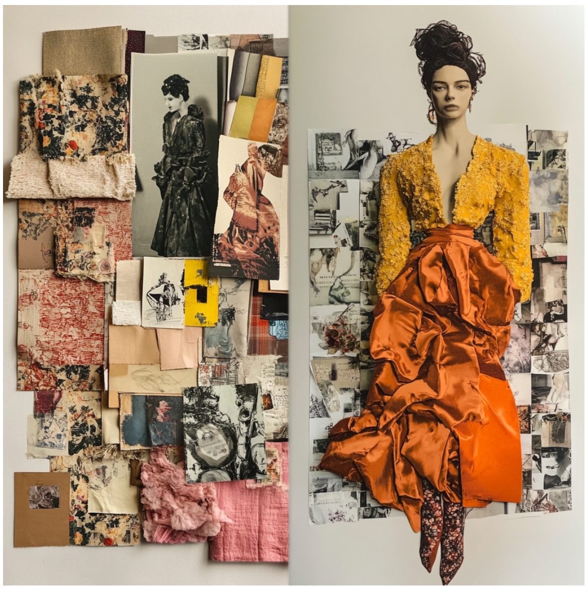

</section>

---

<section>

<h2>How does a fashion curator read FusAIn?</h2>

  

    <strong>Louise – Fashion Curator & Brand Strategy Consultant</strong>  
    After reading the FusAIn paper, she remains globally sceptical about AI in fashion creation, but: 
    <ul>
      <li>She sees FusAIn as closer to <strong>craft + technology</strong> than to "AI magic".</li>
      <li>The pen-based "composition by material/texture" feels aligned with <strong>real design workflows</strong> (moodboards, prototyping, draping).</li>
      <li>The tool appears <strong>less threatening</strong> than other GenAI systems and more like a complement to the designer.</li>
    </ul>
  

  

    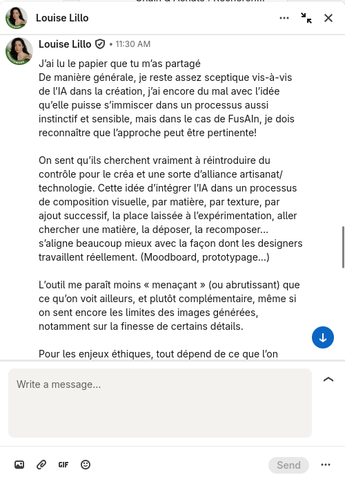
  

  

    Quote.
    « De manière générale, je reste assez sceptique vis-à-vis de l'IA dans la création [...] mais dans le cas de FusAIn, je dois reconnaître que l'approche peut être pertinente ! » – Louise
  

</section>

---

<section>

<h2>What Louise like (and fear) in generative AI</h2>

  

    <h3>1. Alignment with existing practice</h3>
    <ul>
      <li>Works by <strong>adding, recomposing, layering</strong> materials – like building a moodboard on screen.</li>
      <li>Lets designers "go fetch a material, drop it, recombine it" – close to <strong>draping, collage, textile sampling</strong>.</li>
      <li>GenAI becomes a way to <strong>amplify an intention</strong>, not replace it.</li>
    </ul>
  

  

    
  

</section>
<section>

  

    <h3>2. Ethics & boundaries</h3>
    <ul>
      <li><strong>Authorship:</strong> if the designer keeps control, GenAI feels acceptable (and less risky for copyright).</li>
      <li><strong>Environmental impact:</strong> heavy compute cost of AI is a concern in an industry already scrutinized for its impact on the environment.</li>
      <li><strong>Personal limit:</strong> use GenAI as an <em>occasional support</em>, not a constant dependency.</li>
    </ul>
  

  

    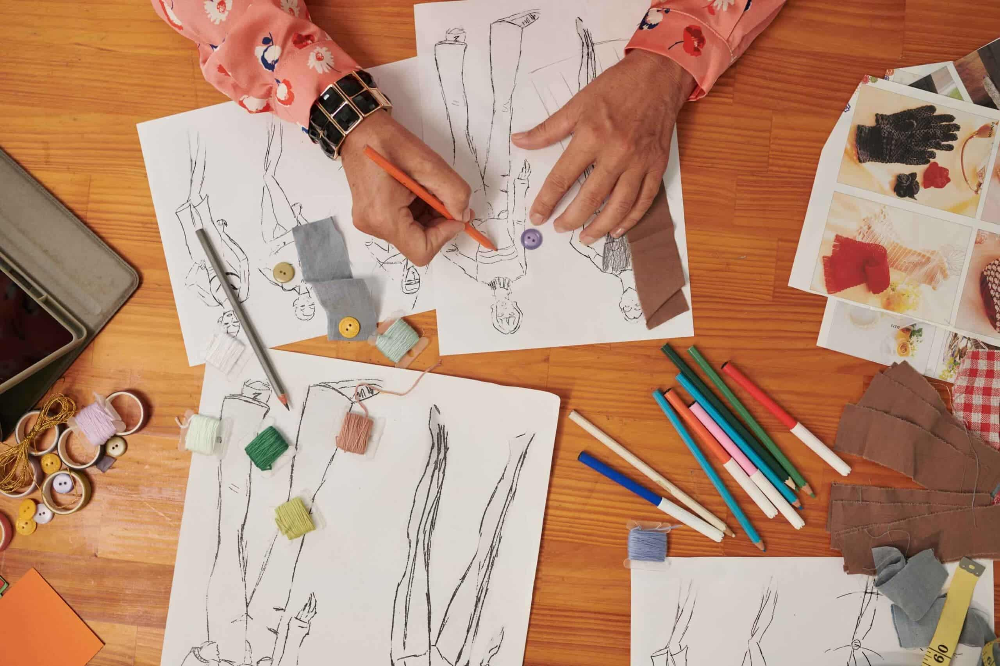
  

  

    Louise.
    Elle parle d'« alliance artisanat/technologie » et d'un outil qui « amplifie l'intention du designer plutôt qu'une technologie qui cherche à la remplacer ».
  

</section>
<section>
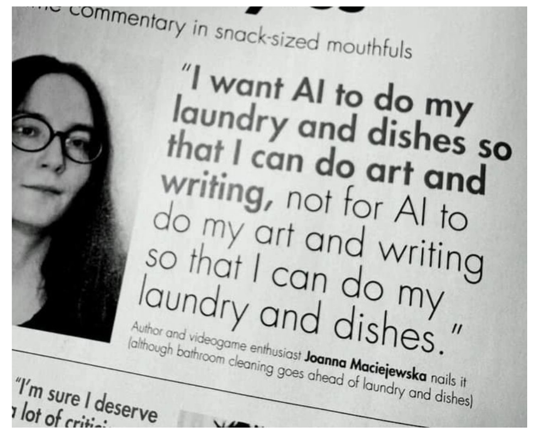
</section>

---

<section>

<h2>Before GenAI (1): Analog tools for generating fashion ideas</h2>

  

    <h3>Early "idea machines" were physical</h3>
    <ul>
      <li><strong>Sketchbooks & croquis:</strong> fast iteration, exaggeration of silhouette, proportion, movement.</li>
    </ul>
  

  

    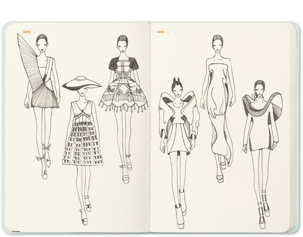
  

  

    Note.
    All of these tools already support deconstruction / reconstruction of shapes, textures, and references – the same logic FusAIn tries to digitize.
  

</section>

<section>

  

    <ul>
      <li><strong>Tracing paper & overlays:</strong> copy a base figure, explore multiple variations (necklines, sleeves, drapes).</li>
    </ul>
  

  

    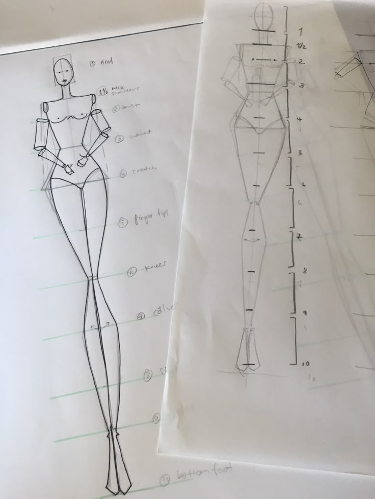
  

</section>

<section>

  

    <ul>
      <li><strong>Moodboards:</strong> magazines, Polaroids, fabric scraps, trims.</li>
    </ul>
  

  

    
  

</section>

<section>

  

    <ul>
      <li><strong>Draping on dress forms:</strong> The mannequin as a physical simulation tool.</li>
    </ul>
  

  

    
  

</section>

<section>

  

    <ul>
      <li><strong>Photocopiers & collage:</strong> scale, repeat, distort motifs and silhouettes by cutting and re-pasting.</li>
    </ul>
  

  

    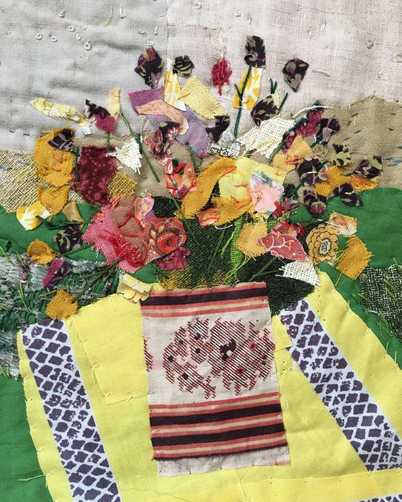
  

</section>

---

<section>

<h2>Before GenAI (2): Digital & semi-generative design tools</h2>

  

    <h3>Digitalization of the fashion workflow</h3>
    <ul>
      <li><strong>Photoshop / Illustrator:</strong> digital croquis, colorways, print repeats, rapid re-coloring and scaling.</li>
    </ul>
  

  

    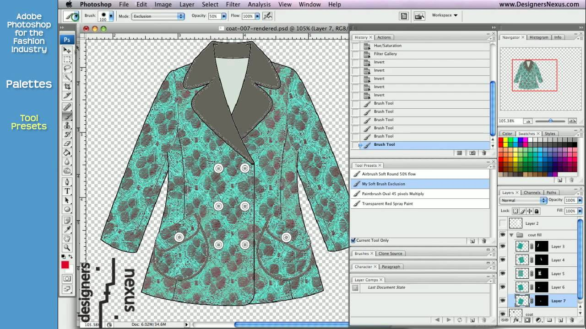
  

  

    Take-away.
    FusAIn sits on top of a long lineage: from sketchbook → photocopier → Photoshop → CAD/3D → parametric tools – it continues the same goal of helping designers explore, combine, and refine visual ideas.
  

</section>

<section>

  

    <ul>
      <li><strong>CAD for pattern-making:</strong> tools like Lectra, Gerber, Optitex – parametrized blocks, grading rules.</li>
    </ul>
  

  

    
    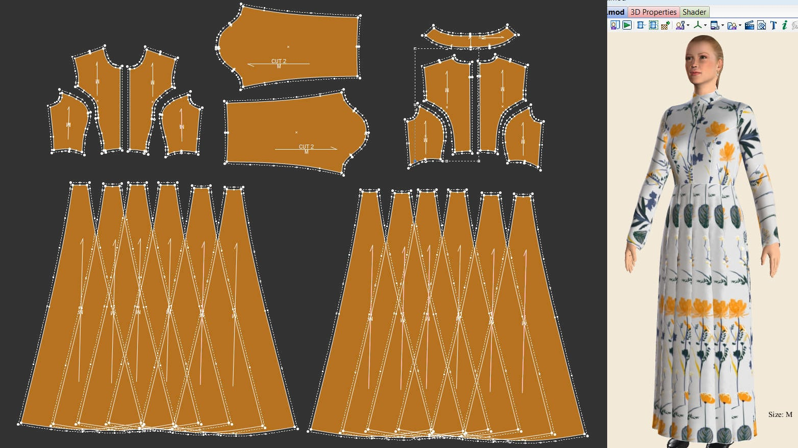
  

</section>

<section>

  

    <ul>
      <li><strong>3D garment simulation:</strong> CLO3D, Browzwear – virtual drape and fit, fabric libraries, avatar bodies.</li>
    </ul>
  

  

    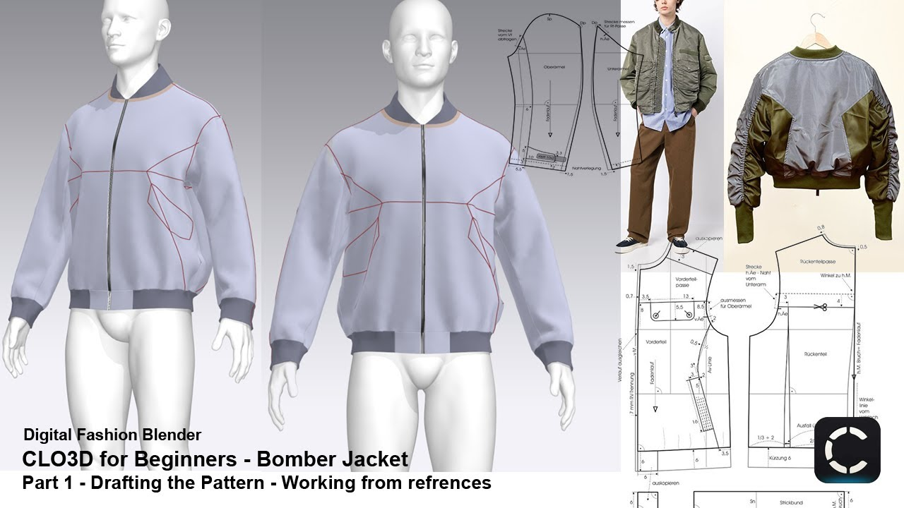
    
  

</section>

<section>

  

    <ul>
      <li><strong>Trend & material databases:</strong> online libraries (e.g., textile mills, WGSN-like services) as "search engines" for inspiration.</li>
    </ul>
  

  

    
  

</section>

---

<section>

  

    <h3>Generative before GenAI</h3>
    <ul>
      <li><strong>Parametric tools in product design:</strong> Grasshopper/Rhino used for shoes, accessories, structures.</li>
      <li><strong>Rule-based pattern systems:</strong> scripts/macros to auto-generate size ranges or detail variants.</li>
      <li>These systems were already <strong>algorithmic</strong>, but not yet "learning" from data as GenAI does.</li>
    </ul>
  

  

    
  

  

    Take-away.
    FusAIn sits on top of a long lineage: from sketchbook → photocopier → Photoshop → CAD/3D → parametric tools – it continues the same goal of helping designers explore, combine, and refine visual ideas.
  

</section>

<section>

---

<section class="slide--section"> 
  

  <h1 class="r-fit-text">A case Study from the industry: Iris van Herpen</h1> 
<em>Exploring craft, technology & AI in haute-couture</em>

</section>

---

<section>
  <h2>Designing at the intersection of craft & science</h2>
  
 
    
 
    • Iris van Herpen’s work fuses couture, new materials and scientific inspiration  
    • She draws on nature, architecture, technology; garments often resemble sculptures, ecosystems, or kinetic structures.
      
    • On AI: She states “AI refines systems, creativity breaks them”.
    

    
 
 
  

</section>

<section>
  <h2>AI in her FW23 Campaign</h2>
  
 
    
 
    • For her FW23 collection “Architectonics”, van Herpen collaborated with photographer Rob Rusling & creative director Nicola Formichetti to generate AI-driven environments that respond to sea, architecture, and hybrid forms.
      
    • Process: She trained the AI on her design “DNA” + archival references + architectural/biological models, then merged produced backgrounds with couture pieces in a controlled photoshoot. 
    

    
 

  

</section>

<section>
    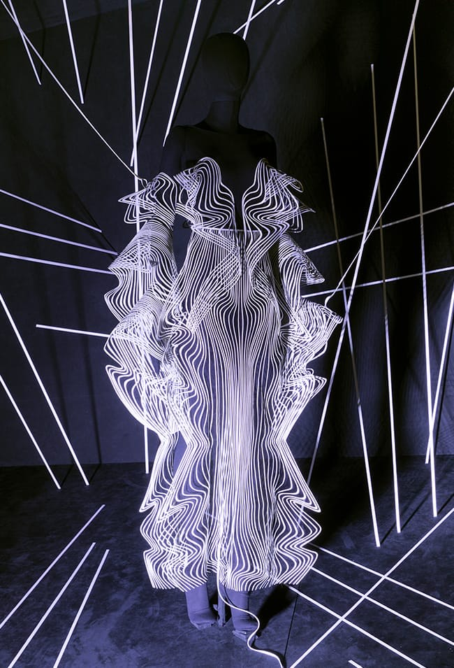 

</section>

<section>

  
 
  
  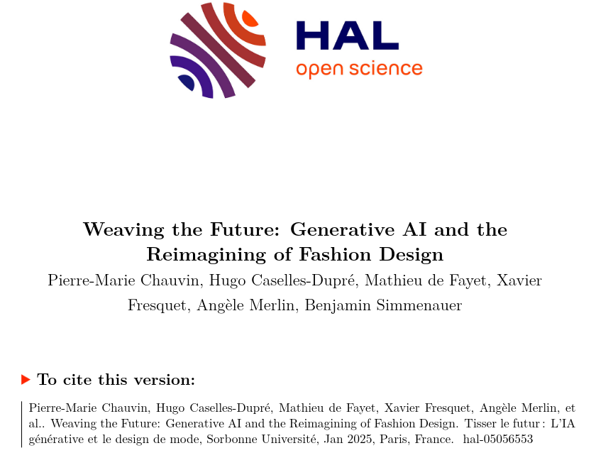
  

</section>