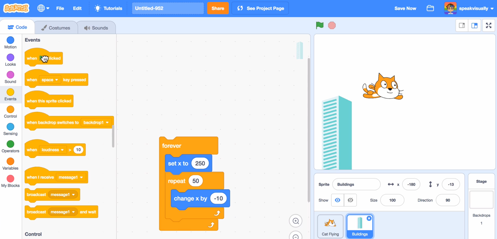
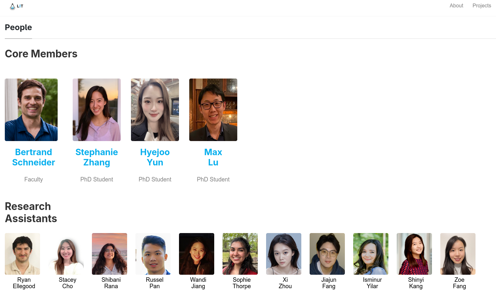
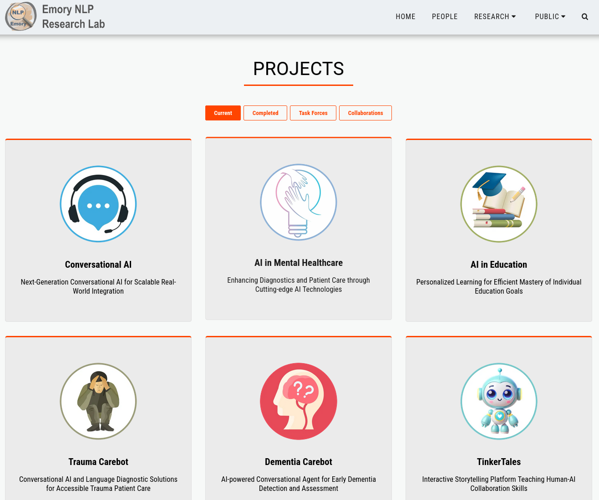
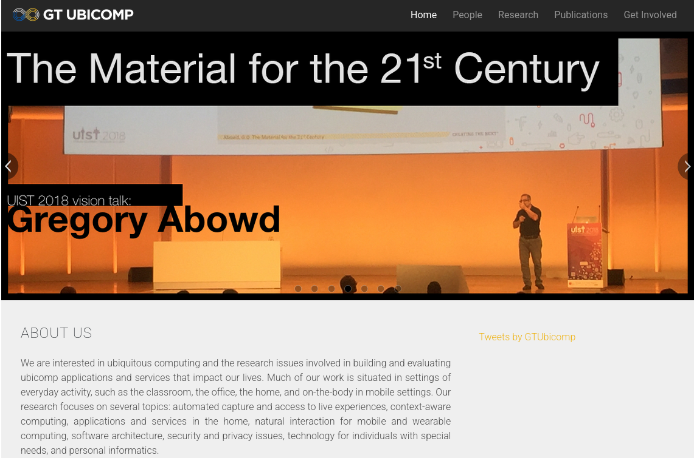
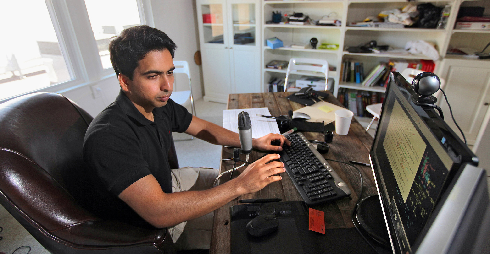
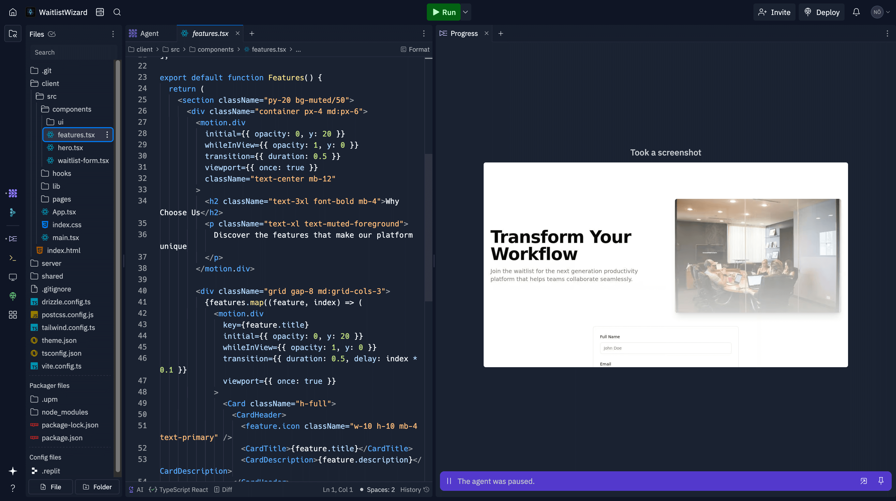

    
    
    
    
    

<section class="slide--section"> 

 <h1 class="r-fit-text">Spellburst : Biography of Authors</h1>

<em>Tyler Angert, Miroslav Suzara, Jenny Han, Christopher Pondoc, Hariharan Subramonyam</em>
 </section>

---

<section>

<h2>Tyler Angert</h2>

  

    First Author 
    Founder and CEO of Patina Systems (2024–Present) – building "spontaneous software" tools for custom everyday apps(1). 
    <ul>
      <li>Interested about creative tools and user empowerment(1)</li>
      <li>His work centers on designing interfaces that blur the line between software users and creators(2)</li>
      <li>He also holds a patent on a "Multiplayer Debugger" for collaborative coding(1)</li>
      <li>Online: Personal website tyler.cafe(1); active on X (Twitter) as @tylerangert</li>
    </ul>
  

  

    
  

  

    1.
    Tyler Angert – Personal website (tyler.cafe) – "Before" section with career and education. https://tyler.cafe/
  

  

    2.
    Our investment in Patina Systems. https://press.airstreet.com/p/our-investment-in-patina-systems
  

</section>
<section>

First designer at replit (a web-based IDE, 2019-2024)

</section>

<section>

Researched "coder's block" for Sratch at the MIT Media Lab for 3 months in 2019

  <iframe src="https://www.google.com/maps/embed?pb=!1m18!1m12!1m3!1d4800.849635236761!2d-71.08841438683572!3d42.36068508657747!2m3!1f0!2f0!3f0!3m2!1i1024!2i768!4f13.1!3m3!1m2!1s0x89e370a8b0f310c5%3A0x1a26a6e6bd5f8030!2sMIT%20Media%20Lab!5e1!3m2!1sfr!2sca!4v1762962274821!5m2!1sfr!2sca" width="1600" height="450" style="border:0;" allowfullscreen="" loading="lazy" referrerpolicy="no-referrer-when-downgrade"></iframe>

</section>
<section>

Studied learning sciences at Harvard LIT lab (2018-2019). Received Ed.M. in 2019

<iframe src="https://www.google.com/maps/embed?pb=!1m18!1m12!1m3!1d10170.252974887342!2d-71.12682420428588!3d42.37546455985341!2m3!1f0!2f0!3f0!3m2!1i1024!2i768!4f13.1!3m3!1m2!1s0x89e37769d1e5853b%3A0x99f678715085d168!2sHarvard%20Graduate%20School%20Of%20Education!5e1!3m2!1sfr!2sca!4v1762963186626!5m2!1sfr!2sca" width="1600" height="450" style="border:0;" allowfullscreen="" loading="lazy" referrerpolicy="no-referrer-when-downgrade"></iframe>

</section>
<section>

Studied computer science at Emory (2014-2018). Received B.S. in 2018

  <iframe src="https://www.google.com/maps/embed?pb=!1m18!1m12!1m3!1d8571.172215746132!2d-84.32747037388843!3d33.792370057187235!2m3!1f0!2f0!3f0!3m2!1i1024!2i768!4f13.1!3m3!1m2!1s0x88f506f1ea7c14e7%3A0x5281878c26da7705!2sDepartment%20of%20Mathematics%20and%20Computer%20Science!5e1!3m2!1sfr!2sca!4v1762962562510!5m2!1sfr!2sca" width="1600" height="450" style="border:0;" allowfullscreen="" loading="lazy" referrerpolicy="no-referrer-when-downgrade"></iframe>

</section>
<section>

Researched at Georgia Tech (2016-2018)

  <iframe
   src="https://www.google.com/maps/embed?pb=!1m18!1m12!1m3!1d5721.5317445872215!2d-84.40053872291335!3d33.77799239647887!2m3!1f0!2f0!3f0!3m2!1i1024!2i768!4f13.1!3m3!1m2!1s0x88f5048a69a04763%3A0xee74b8c342f891fa!2sCollege%20of%20Computing!5e1!3m2!1sfr!2sca!4v1762961953190!5m2!1sfr!2sca" width="1600" height="450" style="border:0;" allowfullscreen="" loading="lazy" referrerpolicy="no-referrer-when-downgrade">
  </iframe>

</section>

---
<section>

Miroslav Suzara

Equal first author

Ph.D. candidate in Learning Sciences and Technology Design (Graduate School of Education) at Stanford University(1). (Admitted 2018)

• Research Interests: Focused on human-AI collaboration in learning contexts(1). His work spans educational technology, collaborative learning methods, and human-AI interaction.

• Notable Work: Also co-authored "The GPT Surprise" (2024), a study on offering ChatGPT in a large coding class (finding reduced student engagement but improved exam performance)(2).

• Online Presence: Personal site miroslavsuzara.com(1)

  

    1.
    Miroslav Suzara – Personal website (miroslavsuzara.com) – PhD/MS status and research areas. https://miroslavsuzara.com/
  

  

    2.
    Nie, A. et al. (2024). "The GPT Surprise: Offering Large Language Model Chat in a Massive Coding Class…" (Stanford/OSF preprint) – Study co-authored by M. Suzara. https://scale.stanford.edu/ai/repository/impact-randomized-controlled-trial
  

</section>

<section>

M.S. student in Computer Science at Stanford (during his PhD?)

  <iframe src="https://www.google.com/maps/embed?pb=!1m18!1m12!1m3!1d254421.20727568187!2d-122.14764845455838!3d37.487783180125774!2m3!1f0!2f0!3f0!3m2!1i1024!2i768!4f13.1!3m3!1m2!1s0x808fbb2a678bea9d%3A0x29cdf01a44fc687f!2sUniversit%C3%A9%20Stanford!5e1!3m2!1sfr!2sca!4v1762967549588!5m2!1sfr!2sca" width="1600" height="450" style="border:0;" allowfullscreen="" loading="lazy" referrerpolicy="no-referrer-when-downgrade"></iframe>

</section>
<section>

M.S. University of Oxford in education (Learning & Technology - 2018)

  <iframe src="https://www.google.com/maps/embed?pb=!1m18!1m12!1m3!1d4260.853282768848!2d-1.2570928223790032!3d51.75704619243412!2m3!1f0!2f0!3f0!3m2!1i1024!2i768!4f13.1!3m3!1m2!1s0x4876c6a9ef8c485b%3A0xd2ff1883a001afed!2sUniversit%C3%A9%20d&#39;Oxford!5e1!3m2!1sfr!2sca!4v1762967382729!5m2!1sfr!2sca" width="1600" height="450" style="border:0;" allowfullscreen="" loading="lazy" referrerpolicy="no-referrer-when-downgrade"></iframe>

</section>
</section>
<section>

Internships as a UX researcher at META on Facebook and WhatsApp

  <iframe src="https://www.google.com/maps/embed?pb=!1m18!1m12!1m3!1d5462.11958869208!2d-122.15315330517774!3d37.48507715675967!2m3!1f0!2f0!3f0!3m2!1i1024!2i768!4f13.1!3m3!1m2!1s0x808fbc96de8dc419%3A0x64979e438bf4e3a5!2sMeta%20Headquarters!5e1!3m2!1sfr!2sca!4v1762967834903!5m2!1sfr!2sca" width="1600" height="450" style="border:0;" allowfullscreen="" loading="lazy" referrerpolicy="no-referrer-when-downgrade"></iframe>

</section>
<section>

B.B.A. Simon Fraser University (2011)

  <iframe src="https://www.google.com/maps/embed?pb=!1m18!1m12!1m3!1d114096.92777485713!2d-122.93657892600913!3d49.26066036510524!2m3!1f0!2f0!3f0!3m2!1i1024!2i768!4f13.1!3m3!1m2!1s0x548679c0857a2227%3A0x506c3f6e30b55b!2sUniversit%C3%A9%20Simon%20Fraser!5e1!3m2!1sfr!2sca!4v1762967724912!5m2!1sfr!2sca" width="1600" height="450" style="border:0;" allowfullscreen="" loading="lazy" referrerpolicy="no-referrer-when-downgrade"></iframe>

</section>

---

<section>

Jenny Han

Equal first author

Currently a prompt Engineer at Khan Academy, building and testing AI-powered tools for teachers(1)

Research keywords include computer science education, child-computer interaction, co-design, and generative AI in learning(1).

Contributed to StoryCoder (voice-guided app for kids, Best paper award CHI 2021) and other HCI education research(1).

Online: Personal website jennylihan.com(1). Also active on LinkedIn and GitHub, and occasionally on X (Twitter) sharing insights on learning design.

  

    1.
    Jenny Han – Personal website, publications list – Spellburst UIST 2023 reference (co-authors noted as equal first authors). https://jennylihan.com/

</section>

<section>

Khan Academy is a nonprofit that offers online learning platform.

In 2022 Adobe donated $1M to Khan Academy to integrate their software to "teach creativity"
</section>

<section>

Previous: Web Developer at UCI's Design & Partnership Lab,

  <iframe src="https://www.google.com/maps/embed?pb=!1m18!1m12!1m3!1d23594.224519939013!2d-117.84666538953066!3d33.64145090593034!2m3!1f0!2f0!3f0!3m2!1i1024!2i768!4f13.1!3m3!1m2!1s0x80dcde0e2592bf91%3A0x79fbc5d0b6dab7ec!2sUniversit%C3%A9%20de%20Californie%20%C3%A0%20Irvine!5e1!3m2!1sfr!2sca!4v1762981102345!5m2!1sfr!2sca" width="1600" height="450" style="border:0;" allowfullscreen="" loading="lazy" referrerpolicy="no-referrer-when-downgrade"></iframe>

</section>

<section>

Product Engineering Intern at Replit,

</section>

<section>

She received a B.S. in Symbolic Systems from Stanford (an interdisciplinary major in CS, linguistics, psychology, and philosophy)

She then received an M.S. in Computer Science (HCI specialization) from Stanford, with a focus on learning technologies(1).

  <iframe src="https://www.google.com/maps/embed?pb=!1m18!1m12!1m3!1d5466.314382364507!2d-122.17263492277142!3d37.427664232076815!2m3!1f0!2f0!3f0!3m2!1i1024!2i768!4f13.1!3m3!1m2!1s0x808fbb2a678bea9d%3A0x29cdf01a44fc687f!2sUniversit%C3%A9%20Stanford!5e1!3m2!1sfr!2sca!4v1762981462923!5m2!1sfr!2sca" width="1600" height="450" style="border:0;" allowfullscreen="" loading="lazy" referrerpolicy="no-referrer-when-downgrade"></iframe>

</section>

---
<section>

Christopher Pondoc

Second author

Stanford University (BS '24 & MS '25 what is co-terminal ??)(1)

Academic interests centered on artificial intelligence and human-computer interaction.(3)

Christopher's research work spans information retrieval and Machine Learning(2). He has contributed to the paper titled "Bridging the Gulf of Envisioning: Cognitive Challenges in Prompt Based Interactions with LLMs presented at CHI'24

Online: Personal website cpondoc.com (1), very active on GitHub and he has a Clay.earth profile (do you know Clay.earth?)(2)

  

    1.
    Christopher Pondoc – Personal website (cpondoc.com) – education and internship experience. https://cpondoc.com/
  

  

    2.
    Christopher Pondoc – Clay Earth profile. https://clay.earth/profile/christopher-pondoc
  

  

    3.
    Christopher Lawrence Pondoc's research works – Stanford/ResearchGate. https://www.researchgate.net/scientific-contributions/Christopher-Lawrence-Pondoc-2258190091
  

</section>

<section>

Christopher interned as a software engineer at Tellor, Splunk, and Coinbase, working on transparent and permissionless oracle protocol for smart contracts on platforms like Ethereum, Polygon, and Algorand (i.e. blockchain/crypto stuff).

  
  
  

</section>

<section>

Entrepreneurship: Founded a startup called Vita EDO (2018–2020), where he served as CEO building an educational technology platform.

</section>

---

<section>

Hariharan Subramonyam

Senior author

Assistant Professor at Stanford University at Stanford's Graduate School of Education, with a courtesy appointment in Computer Science(1)

He is also a Ram and Vijay Shriram Faculty Fellow at Stanford's Human-Centered AI Institute (HAI) and a core faculty member of the Stanford HCI group(1)

He joined Stanford after completing his PhD in 2020.

His research is mainly in HCI and AI in education, (4 paper at CHI'25, one honorable mention, one best paper)(1).

Online: Personal website haridecoded.com (1). Active on X (Twitter) as @HariSubramonyam

  

    1.
    Hariharan Subramonyam – Personal website (haridecoded.com) – faculty roles, research summary, and PhD info. https://haridecoded.com/
  

</section>

<section>

Background: Ph.D. in Information Science from the University of Michigan, where he was advised by Prof. Eytan Adar(1). His academic training combines HCI, learning sciences, and data science.

  <iframe src="https://www.google.com/maps/embed?pb=!1m18!1m12!1m3!1d5093.079831877715!2d-83.74078202265228!3d42.277148940333845!2m3!1f0!2f0!3f0!3m2!1i1024!2i768!4f13.1!3m3!1m2!1s0x883cae38e7de1701%3A0x5ba14e5178e997e3!2sUniversit%C3%A9%20du%20Michigan!5e1!3m2!1sfr!2sca!4v1762984241465!5m2!1sfr!2sca" width="1600" height="450" style="border:0;" allowfullscreen="" loading="lazy" referrerpolicy="no-referrer-when-downgrade"></iframe>

</section>

---

<section>

<iframe src="https://www.google.com/maps/d/embed?mid=1cWwvDFQTvM32Lkbhm1rhCkI9zt4twTI&ehbc=2E312F" width="1600" height="900" style="border:0;" allowfullscreen="" loading="lazy" referrerpolicy="no-referrer-when-downgrade"></iframe>

Notes: Chris and Hariharan share two papers, the other just one

</section>