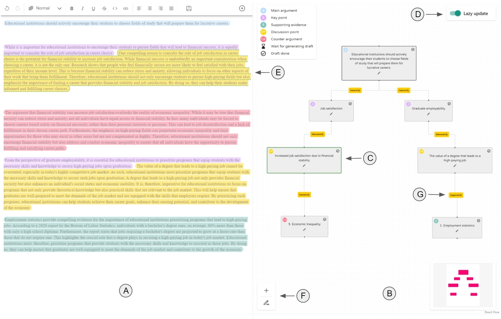
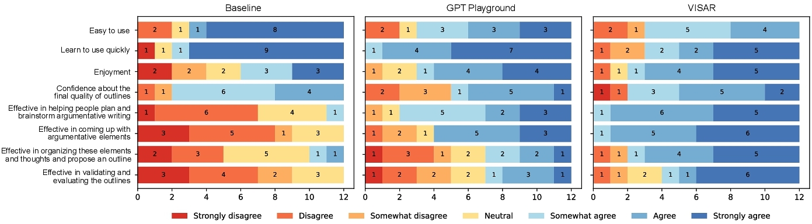
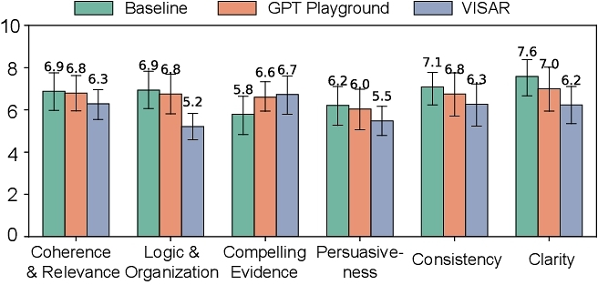
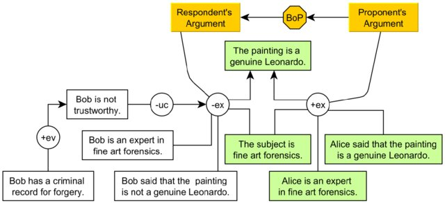
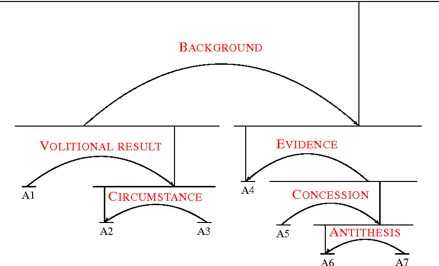

<h1 class = "r-fit-text">VISAR Extended : Research Proposal</h1>  

**A Human–AI Argumentative Writing Assistant with Visual Programming and Rapid Draft Prototyping**  
*UIST 2023 — Yujie Ji, Ruofei Du, and Jian Zhao*

Notes:  
I position myself as a *prospective PhD student* building on VISAR to investigate not only technical improvements, but also **the cognitive and creative consequences of human–AI co-writing**.

---

<section class="slide--section">
  

  <h1 class = "r-fit-text">1. Background</h1>
</section>

---

## VISAR’s Core Idea

VISAR combines **visual programming** and **draft prototyping** to support **argumentative writing planning**.  

---

<section class="slide--section">
  

  <h1 class = "r-fit-text">2. Evaluation & Findings</h1>
</section>

---

<h1>Controlled Study Results</h1>

  

    <h2>Quantitative Results</h2>
    <ul>
      <li>VISAR drafts = <em>passing quality</em> but not excellence</li>
      <li>Lower scores on <strong>Logic & Organization, Coherence & relevance, consistency and clarity</strong> than baseline and GPT Playground</li>
      <li>Users valued structure, yet raters noted <strong>loss of cohesion and narrative flow</strong></li>
    </ul>
  

  

    
    
  

<h2>Qualitative Insights</h2>

Participants reported:  
> “It sometimes deprives my control of writing direction.”  

> “I felt less creative and initiative in thinking about the writing.”

→ Raises a **fundamental question**:  
**Does Gen-AI diminish human creativity and initiative?**

---
## Does Gen-AI diminish human creativity and initiative?

---

<section class="slide--section">
  

  <h1 class = "r-fit-text">3. Identified Gaps</h1>
</section>

---

## Technical & Conceptual Limitations

- **Fixed prompt templates** → repetitive tone  

Prompt: “Write a paragraph supporting the following claim: Online education is effective. Use a formal tone and logical reasoning.”  --> results: "Firstly, online education provides flexibility"

- **No discourse transitions** 

"Online education is convenient. Students can learn anywhere. Some students may lack discipline."

- **Missing argumentative components** from Toulmin's model (1) 

<b>Claim:</b> "Raising the minimum wage reduces poverty."  
 <b>Evidence:</b> "Studies show higher income levels after wage increases."  
  <b>What’s missing</b>  
 <b>Warrant:</b> "Because increased income lets families meet basic needs."  
 <b>Backing:</b> "Research in labor economics links higher income to improved quality of life and reduced social inequality."  
 <b>Qualifier:</b> "In most regions" (not always true).  
 <b>Rebuttal:</b> "However, small businesses may reduce hiring."

Notes: fixed prompt means it is hard coded so it yield very similar sentences everytime "firstly..."/"In conclusion..."
No discourse transitions is a drawback of the current product, there is a lack of connection between arguments
missing argumentative components come from Toulmin models, they missed some
Human arguments are not strictly hierarchical - they're networkedmin model of Argumentation

  

    1.
    Toulmin, S. E. (1958). The Uses of Argument. Cambridge, England: Cambridge University Press.
  

---

## Technical & Conceptual Limitations

- Only tree-structured logic  

Claim: Online learning is effective 
 <-- Evidence: Students perform well 
 <-- counterargument: Some feel isolated
   In reality: [Claim] <-- supported by [Evidence A] and [Evidence B]. 
 [Evidence A] also rebuts [Counterargument] which challenges both [Claim] and [Evidence B]

- And **most importantly:** Unclear *cognitive impact* on writers’ creative agency

---

## Methodological Caveats

- Short-term lab setting 
- No standardized measure of creative engagement, initiative, or cognitive control  

---

<section class="slide--section">
  

  <h1 class = "r-fit-text">4. My Research Proposal</h1>
</section>

---

## Research Questions  

RQ1. How can VISAR support *cohesive discourse* while maintaining *logical coherence* throughout the essay?  
RQ2. How can generated arguments be *more factually grounded*?  
RQ3. **Does Gen-AI reduce writers’ creativity, initiative, or sense of control — and how can we design to preserve them?**

---

<section class="slide--section">
  

  <h1 class = "r-fit-text">5. Proposed Work Packages</h1>
</section>

---

## WP1 — Argument Graphs & Discourse Planning  
To answer RQ1 I aim to:
- Extend VISAR to **network** argumentation (beyond trees)  
- Add **missing Toulmin elements**: claims, backing, warrants, rebuttals (1)
- Integrate **discourse planning** (based on Rhetorical Structure Theory linguistic model(2)) as a new projected view

**Study A:** Compare VISAR-original vs VISAR-EXTENDED on the same tasks, easy experiment to set up

→ Metrics: cohesion, logical adequacy, argument clarity

  

    1.
    Toulmin, S. E. (1958). The Uses of Argument. Cambridge, England: Cambridge University Press.
    2.
    Mann, W. C., & Thompson, S. A. (1988). Rhetorical Structure Theory: Toward a functional theory of text organization. Text, 8(3), 243–281. https://doi.org/10.1515/text.1.1988.8.3.243
  

---

## WP1 — Argument Graphs & Discourse Planning  

  

    1.
    Walton, D., & Koszowy, M. (2018). Whately on authority, deference, presumption and burden of proof. Rhetorica: A Journal of the History of Rhetoric, 36(2), 179–206. https://doi.org/10.1525/rh.2018.36.2.179
    2.
    Forsbom, E. (2005). Rhetorical structure theory in natural language generation. GSLT: Natural Language Generation Lecture.
  

---

## WP2 — Grounding pipeline
To answer RQ2 I aim to:

- Implement **retrieval-augmented generation (RAG)** for verifiable evidence  
- Add **argument validator** to flag unsupported claims  

**Study B:** use the behaviour trace of Study A and perform automatic audits of factual accuracy and bias awareness compare to a ground-truth dataset with the grounding pipeline 

**Study B alternate:** If more HCI-oriented, we can study the impact of continuously "fact-checking" the text and presenting the results to the users, see how this function will affect user's revision.

---

## WP3 — Human Agency, Creativity & Control  
To answer RQ3 I aim to:

**Goal:** Understand how AI assistance impacts *creativity* and *perceived authorship*.  

**Approach:**  
- Compare **High AI-assisted vs. Low AI-assisted vs non-assisted X agent vs direct manipulation** in an argumentative writing tasks  
- Activity analysis: pauses, revisions, speed
- Output analysis: idea divergence, novelty metrics
- Apply **Creative Self-Efficacy**, and **Flow** standardized questionnaires (1,2)
- Use **eye-tracking** to study cognitive engagement (3,4) (e.g. fixation time on AI-generated text, dwell time on AoIs, saccade amplitude, pupil dilation, re-reading frequency, ...) 

**Study C:** Mixed-methods study on creative initiative under different AI-support levels.

  

    1.
    JTierney, P., & Farmer, S. M. (2002). Creative self-efficacy: Its potential antecedents and relationship to creative performance. Academy of Management Journal, 45(6), 1137–1148.
    2.
    Rotter, J. B. (1966). Generalized expectancies for internal versus external control of reinforcement. Psychological Monographs: General and Applied, 80(1), 1–28.
    3.
    The eye-mind of processing written feedback: Unraveling feedback engagement processes in writing tasks using eye-tracking. Learning and Instruction, 87, 101779. https://doi.org/10.1016/j.learninstruc.2023.101779
    4.
    Cognitive engagement and reading comprehension: Evidence from eye-tracking and pupil dilation. Reading and Writing. Advance online publication. https://doi.org/10.1007/s11145-024-10614-8
  

Notes: How would you approach this question scientifically ?

---

<section class="slide--section">
  

  <h1 class = "r-fit-text">6. Hypotheses</h1>
</section>

---

## Key Hypotheses  

- **H1:** VISAR extended → ↑ logical adequacy and cohesion  
- **H2:** Grounding pipeline → ↓ factual errors, 
- **H3:** Increasing AI assistance → ↓ creative self-efficacy and initiative  
- **H4:** Interfaces emphasizing *visual control* (direct manipulation) mitigate loss of agency  

---

<section class="slide--section">
  

  <h1 class = "r-fit-text">8. Expected Contributions</h1>
</section>

---

## Academic Impact  

- Theory of **creative agency under AI assistance**  
- Guidelines for balancing automation with human authorship
- Turing award
- Nobel Peace prize
- Medal of honor

## Practical Impact  

- Design principles for **human-in-the-loop writing tools**  
- Educational implications for teaching critical writing with Gen-AI  

---

## Thank You  
Questions?  
[https://doi.org/10.1145/3586183.3606789](https://doi.org/10.1145/3586183.3606789)

---
